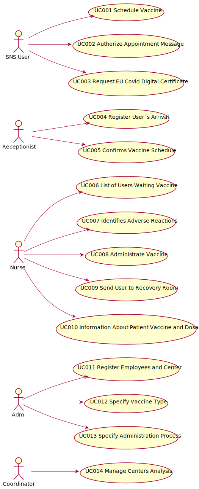

# Use Case Diagram (UCD)

**In the scope of this project, there is a direct relationship of _1 to 1_ between Use Cases (UC) and User Stories (US).**

However, be aware, this is a pedagogical simplification. On further projects and curricular units might also exist _1 to N **and/or** N to 1 relationships between US and UC.

**Insert below the Use Case Diagram in a SVG format**

**For each UC/US, it must be provided evidences of applying main activities of the software development process (requirements, analysis, design, tests and code). Gather those evidences on a separate file for each UC/US and set up a link as suggested below.**

# Use Cases / User Stories
| UC/US  | Description                                                               |                   
|:----|:------------------------------------------------------------------------|
| US 001 | [Schedule Vaccine](US001.md)|
| US 002 | [Authorize Appointment Message](US002.md)|
| US 003 | [Request EU Covid Digital Certificate](US003.md)|
| US 004 | [Register User´s arrival](US004.md)|
| US 005 | [Confirms vaccine schedule](US005.md)|
| US 006 | [List of users waiting vaccine](US006.md)|
| US 007 | [Identifies adverse reactions](US007.md)|
| US 008 | [Administrate vaccine](US008.md)|
| US 009 | [Send user to recovery room](US009.md)|
| US 010 | [Information about patient vaccine and dosage](US010.md)|
| US 011 | [Register employees and center](US011.md)|
| US 012 | [Specify Vaccine Type](US012.md)|
| US 013 | [Specify administration process](US013.md)|
| US 014 | [Manage centers analysis](US014.md)|
|:----|:------------------------------------------------------------------------|

