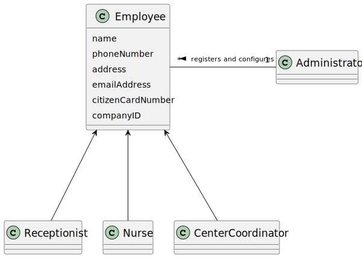
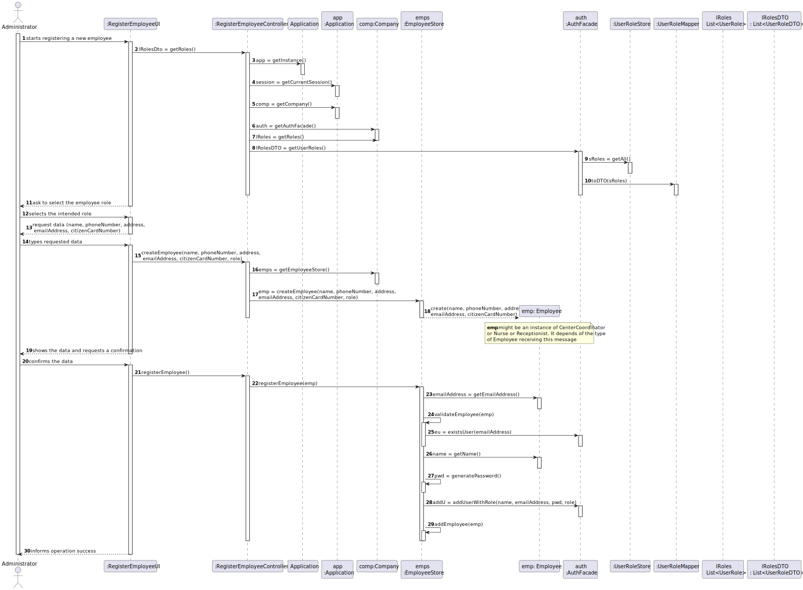

# US 010 - Register Employee

## 1. Requirements Engineering

### 1.1. User Story Description

As an **administrator**, I want to register an **Employee**.

### 1.2. Customer Specifications and Clarifications

Every Employee has only one role (Coordinator, Receptionist, Nurse).

Every employee must have the following attributes; Id (automatic), Name, address, phone number, e-mail, Citizen Card number, and all these attributes are mandatory.
### 1.3. Acceptance Criteria

AC1: Each user must have a single role defined in the system.

AC2: The "auth" component available on the repository must be reused (without modifications).

### 1.4. Found out Dependencies

To complete each operation inside the program the user must have some permissions to access certain information that is given to them when the administrator registers the employees.
the US10 should be able to cooperate with other US especially with US 11 because to complete certain tasks u need to have permissions determined by the US 10

### 1.5 Input and Output Data

**Input Data:**
* Typed data:
    *  name
    *  phone number
    *  address
    *  email address
    *  citizen card number

* Selected data:
    * Employee Role

**Output Data:**
* (In)Success of the operation

the input data are the name, phoneNumber, address, emailAddress, citizenCardNumber, and the system must show the success of the operation to the user.

### 1.6. System Sequence Diagram (SSD)

### 1.7 Other Relevant Remarks

(i) The password must be generated randomly
(ii) Everytime that the company wants to register a new employee to the vaccinations centers

## 2. OO Analysis

### 2.1. Relevant Domain Model Excerpt

### 2.2. Other Remarks

n/a

## 3. Design - User Story Realization

### 3.1. Rationale

**The rationale grounds on the SSD interactions and the identified input/output data.**

| Interaction ID | Question: Which class is responsible for... | Answer                     | Justification (with patterns)                                                                                                           |
|:---------------|:--------------------------------------------|:---------------------------|:----------------------------------------------------------------------------------------------------------------------------------------|
| Step 1  		     | 	...interacts with the user 						          | RegisterEmployeeUI         | Pure Fabrication: the attribution of this this responsibility cannot be justified for any class of the domain module                    |
| Step 2  		     | 						 	...coordinates the UC               | RegisterEmployeeController | Controller                                                                                                                              |
| Step 3  		     | ...knows the user/manager using the system? | Aplication                 | IE: documentation of the component of user managing                                                                                     |                                                                                               |
| Step 4  		     | ... saving the Employee?                    | EmployeeStore              | IE: Knows all Employees                                                                                                                 | 						
| 		 			         | ... knows EmployeeStore?	                   | Company                    | IE: Company knows the EmployeeStore to which it is delegating some tasks                                                                ||                            
| 		             |	... validating all data (local validation)? | Employee                   | IE: an object knows its data                                                                                                            |
| 			  		        |	... validating all data (global validation)? | EmployeeStore              | IE: knows all the employees                                                                                                             | 
|                | ... validate the exclusivity of the client's email? | AuthFacade                 | IE: user management is responsibility of the respective external component whose point of interaction is through the class "AuthFacade" |
| Step 5         | 	... informing operation success?           | RegisterEmployeeUI         | IE: is responsible for user interactions  	                                                                                             | 							                                                  |                            |                                                                                                                      |              

### Systematization ##

According to the taken rationale, the conceptual classes promoted to software classes are:

* Company
* Application
* Employee

Other software classes (i.e. Pure Fabrication) identified:
* RegisterEmployeeUI
* RegisterEmployeeController
* EmployeeStore

Other software classes of external systems/components:

* AuthFacade

## 3.2. Sequence Diagram (SD)

## 3.3. Class Diagram (CD)

# 4. Tests
*In this section, it is suggested to systematize how the tests were designed to allow a correct measurement of requirements fulfilling.*

**_DO NOT COPY ALL DEVELOPED TESTS HERE_**

**Test 1:** Check that it is not possible to create an instance of the Example class with null values.

	@Test(expected = IllegalArgumentException.class)
		public void ensureNullIsNotAllowed() {
		Exemplo instance = new Exemplo(null, null);
	}

*It is also recommended to organize this content by subsections.*

# 5. Construction (Implementation)

*In this section, it is suggested to provide, if necessary, some evidence that the construction/implementation is in accordance with the previously carried out design. Furthermore, it is recommeded to mention/describe the existence of other relevant (e.g. configuration) files and highlight relevant commits.*

*It is also recommended to organize this content by subsections.*

# 6. Integration and Demo

*In this section, it is suggested to describe the efforts made to integrate this functionality with the other features of the system.*

# 7. Observations

*In this section, it is suggested to present a critical perspective on the developed work, pointing, for example, to other alternatives and or future related work.*

