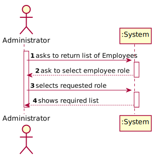
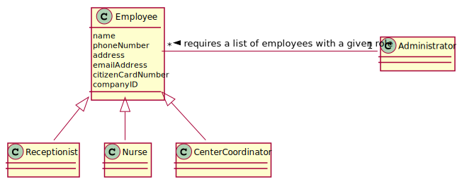

# US 11 - Get a list of employees with a given function/role.

## 1. Requirements Engineering

### 1.1. User Story Description

As an administrator, I want to get a list of employees and their attributes with a given function/role.

### 1.2. Customer Specifications and Clarifications 

**From the specifications document:**

>	Each Employee has a role, (Nurse, Receptionist, CenterCoordinator), that's meant to be listed when asked.
>	The acess to this list is only for the Administrator

**From the client clarifications:**

> **Question:** Besides the name of the employee, what other attributes do we need to show on the list? Can we show every single attribute, including password and username?
>  
> **Answer:**  The application should present all Employee attributes.
Password is not an Employee attribute.

-

> **Question:** Should we assume SNSUsers must also appear on that list?
>  
> **Answer:** The SNS user is not an Employee.
-

> **Question:** Should we give the user the possibility of listing employees from more than 1 role?
>
> **Answer:** The Administrator should select a given role and all employees associated with the selected role should be listed.
- 
> **Question:** Should the list be sorted in any specific way(for example alphabetical name order) or should we give the option to sort by other characteristics?
>
> **Answer:** For now I just want to get a list of employees without considering the order of presentation.

### 1.3. Acceptance Criteria

*US-11 Does not have an acceptance criteria in "Sprint B"

### 1.4. Found out Dependencies

* There is a dependency to "US010 Register an Employee" since the information about employees will be stored upon their registration .

### 1.5 Input and Output Data

**Input Data:**

	
* Selected data:
	* Role selection

**Output Data:**

* List of employees and their attributes with a given role.

### 1.6. System Sequence Diagram (SSD)

**Alternative 1**

### 1.7 Other Relevant Remarks

n/a

## 2. OO Analysis

### 2.1. Relevant Domain Model Excerpt 

### 2.2. Other Remarks

n/a

## 3. Design - User Story Realization 

### 3.1. Rationale

**SSD - Alternative 1 is adopted.**

| Interaction ID | Question: Which class is responsible for... | Answer  | Justification (with patterns)  |
|:-------------  |:--------------------- |:------------|:---------------------------- |
| Step 1  		 |	... interacting with the actor? | CreateTaskUI   |  Pure Fabrication: there is no reason to assign this responsibility to any existing class in the Domain Model.           |
| 			  		 |	... coordinating the US? | CreateTaskController | Controller                             |
| 			  		 |	... instantiating a new Task? | Organization   | Creator (Rule 1): in the DM Organization has a Task.   |
| 			  		 | ... knowing the user using the system?  | UserSession  | IE: cf. A&A component documentation.  |
| 			  		 |	... knowing to which organization the user belongs to? | Platform  | IE: has registed all Organizations |
| 			  		 |							 | Organization   | IE: knows/has its own Employees|
| 			  		 |							 | Employee  | IE: knows its own data (e.g. email) |
| Step 2  		 |							 |             |                              |
| Step 3  		 |	...saving the inputted data? | Task  | IE: object created in step 1 has its own data.  |
| Step 4  		 |	...knowing the task categories to show? | Platform  | IE: Task Categories are defined by the Platform. |
| Step 5  		 |	... saving the selected category? | Task  | IE: object created in step 1 is classified in one Category.  |
| Step 6  		 |							 |             |                              |              
| Step 7  		 |	... validating all data (local validation)? | Task | IE: owns its data.| 
| 			  		 |	... validating all data (global validation)? | Organization | IE: knows all its tasks.| 
| 			  		 |	... saving the created task? | Organization | IE: owns all its tasks.| 
| Step 8  		 |	... informing operation success?| CreateTaskUI  | IE: is responsible for user interactions.  | 

### Systematization ##

According to the taken rationale, the conceptual classes promoted to software classes are: 

 * company
 * RegisterEmployee
 * Employee

Other software classes (i.e. Pure Fabrication) identified: 

 * ListEmployeesUI  
 * ListEmployeesController

## 3.2. Sequence Diagram (SD)

**Alternative 1**

## 3.3. Class Diagram (CD)

**From alternative 1**

# 4. Tests 

 <!-- **Test 1:** Check that it is not possible to create an instance of the Task class with null values. 

	@Test(expected = IllegalArgumentException.class)
		public void ensureNullIsNotAllowed() {
		Task instance = new Task(null, null, null, null, null, null, null);
	}
	

**Test 2:** Check that it is not possible to create an instance of the Task class with a reference containing less than five chars - AC2. 

	@Test(expected = IllegalArgumentException.class)
		public void ensureReferenceMeetsAC2() {
		Category cat = new Category(10, "Category 10");
		
		Task instance = new Task("Ab1", "Task Description", "Informal Data", "Technical Data", 3, 3780, cat);
	}

*It is also recommended to organize this content by subsections.* -->
n/a

# 5. Construction (Implementation)

## Class ListEmployeesController 

		public boolean createTask(String ref, String designation, String informalDesc, 
			String technicalDesc, Integer duration, Double cost, Integer catId)() {
		
			Category cat = this.platform.getCategoryById(catId);
			
			Organization org;
			// ... (omitted)
			
			this.task = org.createTask(ref, designation, informalDesc, technicalDesc, duration, cost, cat);
			
			return (this.task != null);
		}

## Class Organization

		public Task createTask(String ref, String designation, String informalDesc, 
			String technicalDesc, Integer duration, Double cost, Category cat)() {
		
	
			Task task = new Task(ref, designation, informalDesc, technicalDesc, duration, cost, cat);
			if (this.validateTask(task))
				return task;
			return null;
		}

# 6. Integration and Demo 

* A new option on the Employee menu options was added.

* Some demo purposes some tasks are bootstrapped while system starts.

# 7. Observations

Platform and Organization classes are getting too many responsibilities due to IE pattern and, therefore, they are becoming huge and harder to maintain. 

Is there any way to avoid this to happen?

