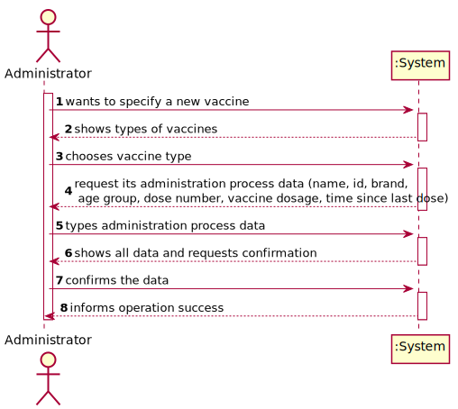

# US 13 - Specify a New Vaccine and its Administration Process

## 1. Requirements Engineering

### 1.1. User Story Description

As an administrator, I intend to specify a new vaccine and its process administration.

### 1.2. Customer Specifications and Clarifications

**From the specifications document:**

>	Each task is characterized by having a unique reference per organization, a designation, an informal and a technical description, an estimated duration and cost as well as the its classifying task category.

>	As long as it is not published, access to the task is exclusive to the employees of the respective organization.

**From the client clarifications:**

> **Question:** We would like to know if when specifying a new Vaccine and its Administration Process, should a list of the existing types of vaccines be displayed in order for him to choose one, or should he just input it?
>
> **Answer:** If the information is available in the system, it is a good practice to present the information to the user and ask the user to select.

> **Question:** Monetary data is expressed in any particular currency?
>
> **Answer:** Monetary data (e.g. estimated cost of a task) is indicated in POTs (virtual currency internal to the platform).

> **Question:** As to the interval between doses, what time format are we to use? (e.g. days, weeks, months)
> 
> **Answer:** Number of days.

> **Question:** Which attributes does the Vaccine have (besides the ones refering to the Vaccine Type)?
>
> **Answer:**  Each vaccine has the following attributes: Id, Name, Brand, Vaccine Type, Age Group, Dose Number, Vaccine Dosage and Time Since Last Dose.

### 1.3. Acceptance Criteria

### 1.4. Found out Dependencies

* There is a dependency to "US12 Specify a new vaccine type" since it's necessary to have this menu built so the administrator, can choose first the type of the vaccine, and then specify the rest.

### 1.5 Input and Output Data

**Input Data:**

* Typed data:
    * vaccine name,
    * id,
    * brand,
    * age group,
    * dose number,
    * vaccine dosage,
    * time since last dose. 

* Selected data:
    * Vaccine type

**Output Data:**

* (In)Success of the operation

### 1.6. System Sequence Diagram (SSD)

**Alternative 1**

**Alternative 2**

n/a

### 1.7 Other Relevant Remarks

n/a

## 2. OO Analysis

### 2.1. Relevant Domain Model Excerpt

### 2.2. Other Remarks

n/a

## 3. Design - User Story Realization

### 3.1. Rationale

**SSD - Alternative 1 is adopted.**

| Interaction ID | Question: Which class is responsible for... | Answer  | Justification (with patterns)  |
|:-------------  |:--------------------- |:------------|:---------------------------- |
| Step 1  		 |	... interacting with the actor? |NewVaccineUI   |  Pure Fabrication: there is no reason to assign this responsibility to any existing class in the Domain Model.           |
| 			  		 |	... coordinating the US? | NewVaccineController | Controller                             |
| 
| Step 2  		 |	...saving the inputted data? | NewVaccine  | IE: object created in step 1 has its own data.  |
| Step 3  		 |	...knowing the vaccine types to show? | Company  | IE: Vaccination types are defined by the Company. |
| Step 4  		 |	... validating all data (local validation)? | NewVaccine | IE: owns its data.| 
| 			  		 |	... validating all data (global validation)? | Company | IE: knows all vaccines.| 
| 			  		 |	... saving the created Vaccine? | NewVaccine | IE: saves the vaccine and adds to a list.| 
| Step 5 		 |	... informing operation success?| NewVaccineUI  | IE: is responsible for user interactions.  | 

### Systematization ##

According to the taken rationale, the conceptual classes promoted to software classes are:

* Company
* NewVaccine

Other software classes (i.e. Pure Fabrication) identified:

* NewVaccineUI
* NewVaccineController

## 3.2. Sequence Diagram (SD)

**Alternative 1**

**Alternative 2**

n/a

## 3.3. Class Diagram (CD)

**From alternative 1**

# 4. Tests

n/a

*It is also recommended to organize this content by subsections.*

# 5. Construction (Implementation)

## Class CreateTaskController

		public boolean createTask(String ref, String designation, String informalDesc, 
			String technicalDesc, Integer duration, Double cost, Integer catId)() {
		
			Category cat = this.platform.getCategoryById(catId);
			
			Organization org;
			// ... (omitted)
			
			this.task = org.createTask(ref, designation, informalDesc, technicalDesc, duration, cost, cat);
			
			return (this.task != null);
		}

n/a

## Class Organization

		public Task createTask(String ref, String designation, String informalDesc, 
			String technicalDesc, Integer duration, Double cost, Category cat)() {
		
	
			Task task = new Task(ref, designation, informalDesc, technicalDesc, duration, cost, cat);
			if (this.validateTask(task))
				return task;
			return null;
		}

n/a

# 6. Integration and Demo

* A new option on the Employee menu options was added.

* Some demo purposes some tasks are bootstrapped while system starts.

# 7. Observations

The US is not finished yet, I still have to develop the code. 
The ESOFT part was kind of confusing in the beginning, especially the SD, and I still think I can improve it on Sprint C. 

