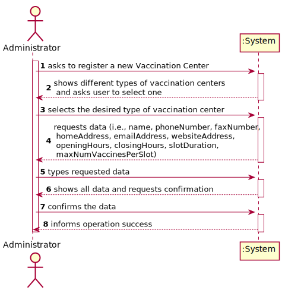
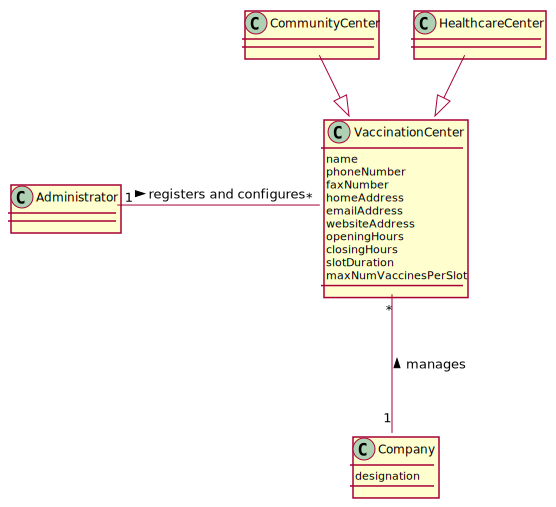
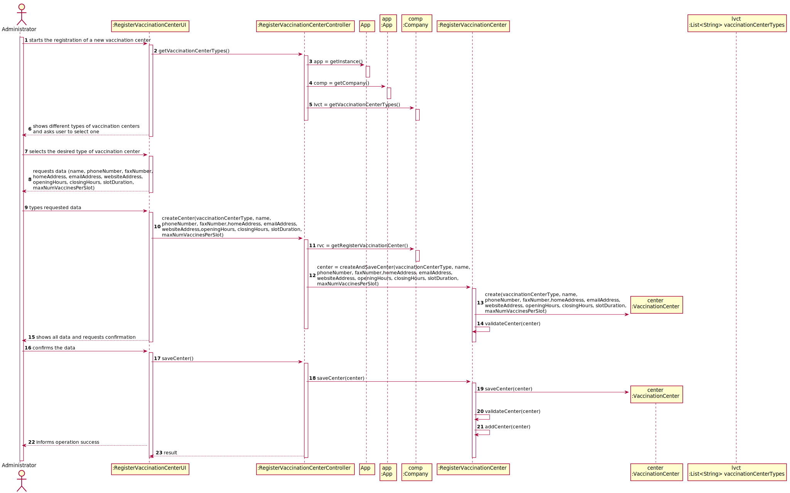
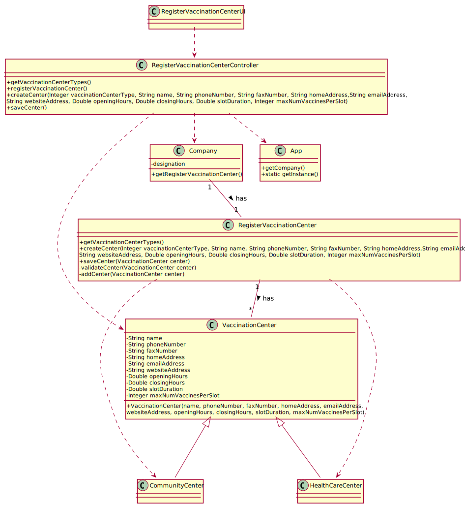

# US 009 - Register a Vaccination Center for Pandemic

## 1. Requirements Engineering

### 1.1. User Story Description

As an **Administrator**, I want to register a **Vaccination Center** to respond to a certain pandemic.

### 1.2. Customer Specifications and Clarifications 

The client did not present any clarification to the questions on the forum but, from my interpretation, I concluded that the Vaccination Center registration is a pretty straight forward procedure where the user only
needs to select the type of center to be registered and, right after that, type all the data related to the center followed by a verification of all the data given.

### 1.3. Acceptance Criteria

n/a

### 1.4. Found out Dependencies

n/a

### 1.5 Input and Output Data

**Input Data:**

* Typed data:
    * a name,
    * a phone number,
    * a fax number,
    * a home address,
    * an email address,
    * a website address,
    * opening hours,
    * closing hours,
    * slot duration,
    * maximum number of vaccines per slot.

* Selected data:
    * vaccination center type.
    
**Output Data:**

* (In)Success of the operation
### 1.6. System Sequence Diagram (SSD)

### 1.7 Other Relevant Remarks

n/a

## 2. OO Analysis

### 2.1. Relevant Domain Model Excerpt 

### 2.2. Other Remarks

n/a

## 3. Design - User Story Realization 

### 3.1. Rationale

**The rationale grounds on the SSD interactions and the identified input/output data.**

| Interaction ID | Question: Which class is responsible for... | Answer  | Justification (with patterns)  |
|:-------------  |:--------------------- |:------------|:---------------------------- |
| Step 1  		 |	...interacting with the actor?						 |RegisterVaccinationCenterUI             |Pure Fabrication: there is no reason to assign this responsibility to any existing class in the Domain Model.                              |
|   		 |	...coordinating the US?							 |RegisterVaccinationCenterController             |Controller                              |
| Step 2  		 |	...saving the inputed data						 |VaccinationCenter             |IE: object created in step 1 has its own data.                              |
| Step 4  		 |	...knowing the Vaccination Center types to show?						 |Company             |IE: Vaccination Center types are defined by the Company.                              |
| Step 5  		 |	...validating all data (local validation)?						 |VaccinationCenter             |IE: owns its data.                              |
|   		 |	...validating all data (global validation)?						 |RegisterVaccinationCenter             |IE: knows all Vaccination Centers.                              |              
|   		 |	...saving the created Vaccination Center?						 |RegisterVaccinationCenter             |IE: owns all Vaccination Centers.                              |
| Step 6  		 |	...informing operation success?						 |RegisterVaccinationCenterUI             |IE: is responsible for user interactions.                              |

### Systematization ##

According to the taken rationale, the conceptual classes promoted to software classes are: 

 * RegisterVaccinationCenter
 * Company
 * VaccinationCenter

Other software classes (i.e. Pure Fabrication) identified: 
 * RegisterVaccinationCenterUI  
 * RegisterVaccinationCenterController

## 3.2. Sequence Diagram (SD)

## 3.3. Class Diagram (CD)

# 4. Tests 
*In this section, it is suggested to systematize how the tests were designed to allow a correct measurement of requirements fulfilling.* 

**_DO NOT COPY ALL DEVELOPED TESTS HERE_**

**Test 1:** Check that it is not possible to create an instance of the Example class with null values. 

	@Test(expected = IllegalArgumentException.class)
		public void ensureNullIsNotAllowed() {
		Exemplo instance = new Exemplo(null, null);
	}

*It is also recommended to organize this content by subsections.* 

# 5. Construction (Implementation)

*In this section, it is suggested to provide, if necessary, some evidence that the construction/implementation is in accordance with the previously carried out design. Furthermore, it is recommeded to mention/describe the existence of other relevant (e.g. configuration) files and highlight relevant commits.*

*It is also recommended to organize this content by subsections.* 

# 6. Integration and Demo 

*In this section, it is suggested to describe the efforts made to integrate this functionality with the other features of the system.*

# 7. Observations

The US is not finished yet, I still have to develop the code. Besides that, the ESOFT component of the US went great, it was my first time working on a US and it was not easy, especially the SD development. I plan on fixing the issues
that the teacher points out about my models and finish the code as soon as possible.

