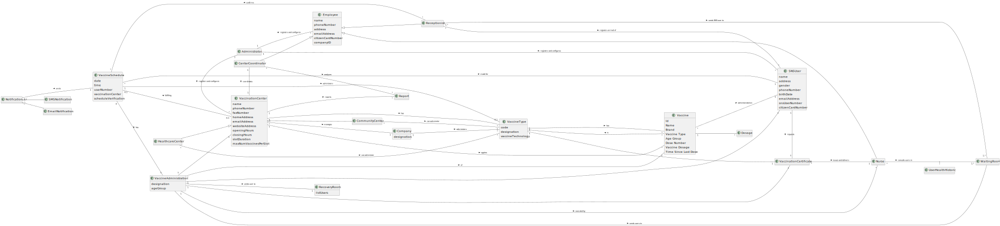

# OO Analysis #

The construction process of the domain model is based on the client specifications, especially the nouns (for _concepts_) and verbs (for _relations_) used.

## Rationale to identify domain conceptual classes ##
To identify domain conceptual classes, start by making a list of candidate conceptual classes inspired by the list of categories suggested in the book "Applying UML and Patterns: An Introduction to Object-Oriented Analysis and Design and Iterative Development".

### _Conceptual Class Category List_ ###

**Business Transactions**

* Scheduling the Vaccine

---

**Transaction Line Items**

*

---

**Product/Service related to a Transaction or Transaction Line Item**

* Vaccine Administration
* Certificate

---

**Transaction Records**

* Vaccination Certificate

---  

**Roles of People or Organizations**

* Administrator
* Center Coordinator
* SNSUser
* Receptionist
* Nurse

---

**Places**

* Healthcare Center
* Community Mass Vaccination Center

---

**Noteworthy Events**

* Vaccination Process
* Immunization
* Recovery Period
* Covid-19 disease

---

**Physical Objects**

* Citizen Card

---

**Descriptions of Things**

* Vaccine Type
* Vacinne Brand
* Vaccine Dosage
* Name
* Address
* Phone Number
* E-mail Address
* Fax Number
* Website Address
* Opening  and  Closing Hours
* Slot Duration

---

**Catalogs**

*

---

**Containers**

*

---

**Elements of Containers**

*

---

**Organizations**

* SNS
* DGS
* ARS
* AGES

---

**Other External/Collaborating Systems**

*

---

**Records of finance, work, contracts, legal matters**

*

---

**Financial Instruments**

*

---

**Documents mentioned/used to perform some work/**

* Citizen Card

---

###**Rationale to identify associations between conceptual classes**###

An association is a relationship between instances of objects that indicates a relevant connection and that is worth of remembering, or it is derivable from the List of Common Associations:

+ **_A_** is physically or logically part of **_B_**
+ **_A_** is physically or logically contained in/on **_B_**
+ **_A_** is a description for **_B_**
+ **_A_** known/logged/recorded/reported/captured in **_B_**
+ **_A_** uses or manages or owns **_B_**
+ **_A_** is related with a transaction (item) of **_B_**
+ etc.

| Concept (A) 		|  Association   	|  Concept (B) |
|----------	   		|:-------------:		|------:       |
| Administrator  	| registers and configures    		 	| Employee  |
| CenterCoordinator  	| coordinates    		 	| VaccinationCenter  |
|   	| analyses    		 	| Report  |
| CommunityCenter  	| can administer    		 	| VaccineType  |
| Company  	| manages    		 	| VaccinationCenter  |
| HealthcareCenter  	| can administer    		 	| VaccineType  |
| Nurse  	| sends SNS user to    		 	| WaitingRoom  |
|   	| issues and delivers    		 	| VaccinationCertificate  |
|   	| sends user to    		 	| RecoveryRoom  |
| Receptionist  	| registers arrival of    		 	| SNSUser  |
|   	| confirms    		 	| VaccineSchedule  |
|   	| sends SNS user to    		 	| WaitingRoom  |
| ScheduleVerification  	| confirms    		 	| VaccineSchedule  |
|   	| emits    		 	| Notification  |
| SNSUser  	| requests    		 	| VaccinationCertificate  |
| VaccinationCenter  	| applies    		 	| Vaccine  |
|   	| reports    		 	| Report  |
| Vaccine  	| is    		 	| VaccineType  |
| VaccineAdministration  	| of    		 	| Vaccine  |
|   	| administrated on    		 	| SNSUser  |
|   	| has    		 	| Dose  |
|   	| executed by    		 	| Nurse  |
| VaccineSchedule  	| made for    		 	| SNSUser  |

## Domain Model

**Do NOT forget to identify concepts atributes too.**

**Insert below the Domain Model Diagram in a SVG format**

