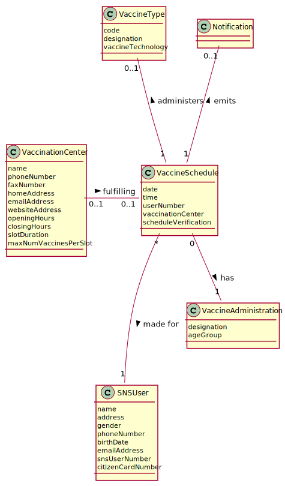
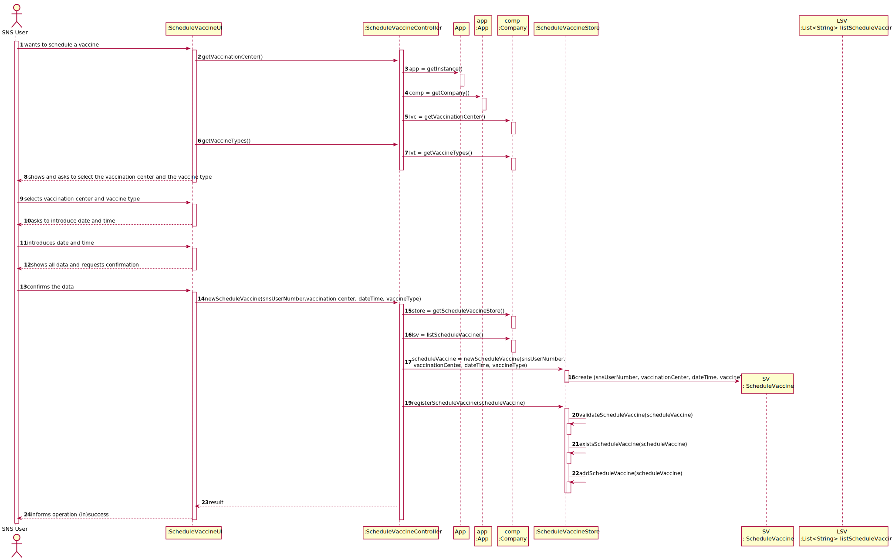

# US 1 - Schedule a Vaccine as a SNS User

## 1. Requirements Engineering

### 1.1. User Story Description

As a SNS user, I intend to use the application to schedule a vaccine.

### 1.2. Customer Specifications and Clarifications

**From the specifications document:**

>	"To take a vaccine, the SNS user should use the application to schedule his/her vaccination. The user should introduce his/her SNS user number, select the vaccination center, the date, and the time (s)he wants to be vaccinated as well as the type of vaccine to be administered (by default, the system suggests the one related to the ongoing outbreak). Then, the application should check the vaccination center capacity for that day/time and, if possible, confirm that the vaccination is scheduled and inform the user that (s)he should be at the selected vaccination center at the scheduled day and time."

**From the client clarifications:**

> **Question:** Should the application send the SMS with the confirmation of the schedule or will it be other user story in the future?
>
> **Answer:**

### 1.3. Acceptance Criteria

* **AC1:** A SNS user cannot schedule the same vaccine more than once.

### 1.4. Found out Dependencies

* There is a dependency to "US9 Register a Vaccination Center" since its required to exist a vaccination center so the user can take the vaccine.
* There is a dependency to "US12 Specify a new vaccine type" and "US13 Specify a new vaccine and its administration process" because, in order to book an appointment, a vaccine needs to exit and its administration process known.

### 1.5 Input and Output Data

**Input Data:**

* Typed data:
  * SNS user number

* Selected data:
  * Vaccination Center
  * Date
  * Time
  * Vaccine Type

**Output Data:**

* (In)Success of the operation

### 1.6. System Sequence Diagram (SSD)

**Alternative 1**

### 1.7 Other Relevant Remarks

* The created task stays in a "not published" state in order to distinguish from "published" tasks.

## 2. OO Analysis

### 2.1. Relevant Domain Model Excerpt

### 2.2. Other Remarks

n/a

## 3. Design - User Story Realization

### 3.1. Rationale

**SSD - Alternative 1 is adopted.**

| Interaction ID | Question: Which class is responsible for... | Answer  | Justification (with patterns)  |
|:-------------  |:--------------------- |:------------|:---------------------------- |
| Step 1  		 |	... interacting with the actor? | ScheduleVaccineUI   |  Pure Fabrication: there is no reason to assign this responsibility to any existing class in the Domain Model.           |
| 			     |	... coordinating the US? | ScheduleVaccineController | Controller                             |
| 			  	 |	... instantiating a new Vaccine Schedule? | ScheduleVaccine   | Creator (Rule 1): ScheduleVaccine is created by ScheduleVaccineStore.   |
| 			  	 |	... knowing to which company the user belongs to? | App  | IE: has registed all companies. |
| 			  	 |							 | Company   | IE: knows all Vaccination Centers.|
| Step 2  		 |	... requesting sns user number?	 |             |                              |
| Step 3  		 |	...saving the inputted data? | ScheduleVaccine  | IE: object created in step 1 has its own data.  |
| Step 4  		 |	...knowing and asking to select the data to show? | Company  | IE: The Company has all the information needed. |
| Step 5  		 |	... saving the selected data? | ScheduleVaccine  | IE: Owns its data.  |
| Step 6  		 |	... showing all data and request its confirmation?	|             |                              |              
| Step 7  		 |	... confirming the data? | | | 
| 			  	 |	... validating all data (global validation)? | ScheduleVaccineStore | IE: knows all appointments.| 
| 			  	 |	... saving the created appointment? | ScheduleVaccineStore | IE: knows all appointments.| 
| Step 8  		 |	... informing operation success?| ScheduleVaccineUI  | IE: is responsible for user interactions.  | 

### Systematization ##

According to the taken rationale, the conceptual classes promoted to software classes are:

* ScheduleVaccine
* Company

Other software classes (i.e. Pure Fabrication) identified:

* ScheduleVaccineUI
* ScheduleVaccineController
* ScheduleVaccineStore

## 3.2. Sequence Diagram (SD)

**Alternative 1**

## 3.3. Class Diagram (CD)

**From alternative 1**

# 4. Tests

**Test 1:** Check that it is not possible to create an instance of the Task class with null values.

	@Test(expected = IllegalArgumentException.class)
		public void ensureNullIsNotAllowed() {
		Task instance = new Task(null, null, null, null, null, null, null);
	}

# 5. Construction (Implementation)

## Class ScheduleVaccineController

		public boolean createTask(String ref, String designation, String informalDesc, 
			String technicalDesc, Integer duration, Double cost, Integer catId)() {
		
			Category cat = this.platform.getCategoryById(catId);
			
			Organization org;
			// ... (omitted)
			
			this.task = org.createTask(ref, designation, informalDesc, technicalDesc, duration, cost, cat);
			
			return (this.task != null);
		}

## Class ScheduleVaccine

		public Task createTask(String ref, String designation, String informalDesc, 
			String technicalDesc, Integer duration, Double cost, Category cat)() {
		
	
			Task task = new Task(ref, designation, informalDesc, technicalDesc, duration, cost, cat);
			if (this.validateTask(task))
				return task;
			return null;
		}

# 6. Integration and Demo

* A new option on the Employee menu options was added.

* Some demo purposes some tasks are bootstrapped while system starts.

# 7. Observations

Platform and Organization classes are getting too many responsibilities due to IE pattern and, therefore, they are becoming huge and harder to maintain.

