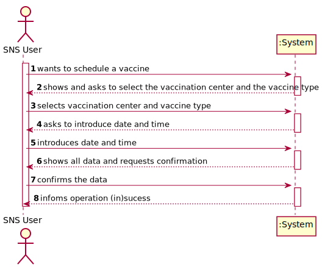

# US 1 - Schedule a Vaccine as a SNS User

## 1. Requirements Engineering

### 1.1. User Story Description

As a SNS user, I intend to use the application to schedule a vaccine.

### 1.2. Customer Specifications and Clarifications

**From the specifications document:**

>	"To take a vaccine, the SNS user should use the application to schedule his/her vaccination. The user should introduce his/her SNS user number, select the vaccination center, the date, and the time (s)he wants to be vaccinated as well as the type of vaccine to be administered (by default, the system suggests the one related to the ongoing outbreak). Then, the application should check the vaccination center capacity for that day/time and, if possible, confirm that the vaccination is scheduled and inform the user that (s)he should be at the selected vaccination center at the scheduled day and time."

**From the client clarifications:**

> **Question:** Does the user have to enter the date and time they want or does the system have to show the available dates and times for the user to select?
> 
> **Answer:**  In this sprint the actor should introduce (using the keyboard) the date and time (s)he wants to be vaccinated.

> **Question:** We are unsure if it's in this user stories that's asked to implement the "send a SMS message with information about the scheduled appointment" found on the Project Description available in moodle. Could you clarify?
> 
> **Answer:** In a previous clarification that I made on this forum, I said: "The user should receive a SMS Message to warn of a scheduling [and the message] should include: Date, Time and vaccination center". Teams must record the answers!
A file named SMS.txt should be used to receive/record the SMS messages. We will not use a real word service to send SMSs

### 1.3. Acceptance Criteria

* **AC1:** A SNS user cannot schedule the same vaccine more than once.

### 1.4. Found out Dependencies

* There is a dependency to "US9 Register a Vaccination Center" since its required to exist a vaccination center so the user can take the vaccine.
* There is a dependency to "US12 Specify a new vaccine type" and "US13 Specify a new vaccine and its administration process" because, in order to book an appointment, a vaccine needs to exit and its administration process known.

### 1.5 Input and Output Data

**Input Data:**

* Typed data:
  * Date and time

* Selected data:
  * Vaccination Center
  * Vaccine Type

**Output Data:**

* (In)Success of the operation

### 1.6. System Sequence Diagram (SSD)

**Alternative 1**

### 1.7 Other Relevant Remarks

n/a

## 2. OO Analysis

### 2.1. Relevant Domain Model Excerpt

### 2.2. Other Remarks

n/a

## 3. Design - User Story Realization

### 3.1. Rationale

**SSD - Alternative 1 is adopted.**

| Interaction ID | Question: Which class is responsible for... | Answer  | Justification (with patterns)  |
|:-------------  |:--------------------- |:------------|:---------------------------- |
| Step 1  		 |	... interacting with the actor? | ScheduleVaccineUI   |  Pure Fabrication: there is no reason to assign this responsibility to any existing class in the Domain Model.           |
| 			     |	... coordinating the US? | ScheduleVaccineController | Controller                             |
| 			  	 |	... instantiating a new Vaccine Schedule? | ScheduleVaccine   | Creator (Rule 1): ScheduleVaccine is created by ScheduleVaccineStore.   |
| 			  	 |	... knowing to which company the user belongs to? | App  | IE: has registed all companies. |
| 			  	 |							 | Company   | IE: knows all Vaccination Centers.|
| Step 2  		 |	... requesting sns user number?	 |             |                              |
| Step 3  		 |	...saving the inputted data? | ScheduleVaccine  | IE: object created in step 1 has its own data.  |
| Step 4  		 |	...knowing and asking to select the data to show? | Company  | IE: The Company has all the information needed. |
| Step 5  		 |	... saving the selected data? | ScheduleVaccine  | IE: Owns its data.  |
| Step 6  		 |	... showing all data and request its confirmation?	|             |                              |              
| Step 7  		 |	... confirming the data? | | | 
| 			  	 |	... validating all data (global validation)? | ScheduleVaccineStore | IE: knows all appointments.| 
| 			  	 |	... saving the created appointment? | ScheduleVaccineStore | IE: knows all appointments.| 
| Step 8  		 |	... informing operation success?| ScheduleVaccineUI  | IE: is responsible for user interactions.  | 

### Systematization ##

According to the taken rationale, the conceptual classes promoted to software classes are:

* ScheduleVaccine
* Company

Other software classes (i.e. Pure Fabrication) identified:

* ScheduleVaccineUI
* ScheduleVaccineController
* ScheduleVaccineStore

## 3.2. Sequence Diagram (SD)

**Alternative 1**

## 3.3. Class Diagram (CD)

**From alternative 1**

# 4. Tests

**Test 1:** Check the program knows the SNS User gender.

	void getGender() throws ParseException {
        Date dtest = new SimpleDateFormat("dd/MM/yyyy").parse("02/05/2003");
        SNSUser user = new SNSUser("Test","male",dtest ,"street test", "923456789","user@test.com","123453678","12345342");

        assertEquals("male", user.getGender());
    }

# 5. Construction (Implementation)

## Class ScheduleVaccineController

    public class ScheduleVaccineController {

      private App oApp;
      private Company oCompany;
      private ScheduleVaccine oScheduleVaccine;
      private final AuthFacade authFacade;
      private final ScheduleVaccineStore scheduleVaccineStore;
      private final VaccinationCenterStore vaccinationCenterStore;
      private final VaccineTypeStore vaccineTypeStore;
      private final SNSUserStore snsUserStore;

    public ScheduleVaccineController() {
        this.oApp = App.getInstance();
        this.oCompany = oApp.getCompany();
        this.authFacade = this.oCompany.getAuthFacade();
        this.scheduleVaccineStore = oCompany.getScheduleVaccineStore();
        this.vaccinationCenterStore = oCompany.getVaccinationCenterStore();
        this.vaccineTypeStore = oCompany.getVaccineTypeStore();
        this.snsUserStore = oCompany.getSNSUserStore();
    }

    public boolean newScheduleVaccine(ScheduleVaccineDTO scheduleVaccineDTO) {
        this.oScheduleVaccine = oCompany.getScheduleVaccineStore().newScheduleVaccine(scheduleVaccineDTO);
        if (this.oScheduleVaccine != null) {
            return true;
        } else {
            return false;
        }
    }

    public String getScheduleVaccineString() {
        return this.oScheduleVaccine.toString();
    }

    public List<VaccinationCenter> getVaccinationCenter() {
        return this.vaccinationCenterStore.getVaccinationCenters();
    }

    public List<VaccineType> getVaccineTypes() {
        return this.vaccineTypeStore.getListVaccineType();
    }

    public boolean registerScheduleVaccine() {
        return this.oCompany.getScheduleVaccineStore().registerScheduleVaccine(this.oScheduleVaccine);
    }

    public ScheduleVaccine getScheduleVaccine() {
        return oScheduleVaccine;
    }

## Class ScheduleVaccine

	public class ScheduleVaccine {

      private String snsUserNumber;
      private VaccinationCenter vaccinationCenter;
      private VaccineType vaccineType;
      private Date dateTime;

    public ScheduleVaccine(String snsUserNumber, VaccinationCenter vaccinationCenter,VaccineType vaccineType, Date dateTime) {

        if((vaccinationCenter == null)  ||
                (snsUserNumber == null) )

            throw new IllegalArgumentException("None of the arguments can be null or empty.");

        setSNSUserNumber(snsUserNumber);
        setVaccineType(vaccineType);
        setVaccinationCenter(vaccinationCenter);
        setDateTime(dateTime);

    }

    public void setVaccineType(VaccineType vaccineType) {
        this.vaccineType = vaccineType;
    }

    public Date getDateTime() {
        return dateTime;
    }

    public void setDateTime(Date dateTime) {
        this.dateTime = dateTime;
    }

    public String getSNSUserNumber() {
        return snsUserNumber;
    }

    public void setSNSUserNumber(String SNSUserNumber) {
        this.snsUserNumber = SNSUserNumber;
    }

    public VaccinationCenter getVaccinationCenter() {
        return vaccinationCenter;
    }

    public void setVaccinationCenter(VaccinationCenter vaccinationCenter) {
        this.vaccinationCenter = vaccinationCenter;
    }

    public String toString() {
        return "The SNS User number " + snsUserNumber + " has his vaccine appointment schedule at " +dateTime+" at: "+vaccinationCenter.toStringScheduleVaccine();
    }

    public VaccineType getVaccineType() {
        return vaccineType;
    }
}

# 6. Integration and Demo

* A SNS User menu was added.

* For demonstration purposes, some SNS Users and its schedules are bootstrapped while system starts.

# 7. Observations

