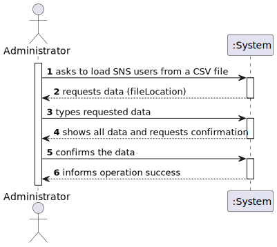

# US 14 - Load a set of users from a CSV file, as an Administrator
## 1. Requirements Engineering

### 1.1. User Story Description

As an administrator, I want to load a set of users from a CSV file.

### 1.2. Customer Specifications and Clarifications

**From the client clarifications:**

> **Question:** In which format will be given the date of birth (YYYY/MM/DD or DD/MM/YYYY)
>
> **Answer:** In a previous clarification I said: "The dates registered in the system should follow the Portuguese format (dd/mm/yyyy)"

> **Question:** Is it possible that the file can contain lines with incomplete information in some fields (e.g. N/A). If so, should we read those lines as well and leave those fields empty or shall we discard that complete line?
>
> **Answer:** CSV files that have errors should not be loaded. Opcional attributes may have a NA value.

> **Question:** What would be the sequence of parameters to be read on the CSV? For example: "Name | User Number".
>
> **Answer:** Name, Sex, Birth Date, Address, Phone Number, E-mail, SNS User Number and Citizen Card Number.

### 1.3. Acceptance Criteria

* **AC1:** The application must support importing two types of CSV
  files: a) one type must have a header, column separation is done using “;”
  character; b) the other type does not have a header, column separation is done
  using “,” character.

### 1.4. Found out Dependencies

N/A

### 1.5 Input and Output Data

**Input Data:**

* Typed data:
    * File Location

**Output Data:**

* Updated list of SNS Users
* (In)Success of the operation

### 1.6. System Sequence Diagram (SSD)

**Alternative 1**

### 1.7 Other Relevant Remarks

N/A

## 2. OO Analysis

### 2.1. Relevant Domain Model Excerpt

### 2.2. Other Remarks

n/a

## 3. Design - User Story Realization

### 3.1. Rationale

**SSD - Alternative 1 is adopted.**

| Interaction ID | Question: Which class is responsible for... | Answer  | Justification (with patterns)  |
|:-------------  |:--------------------- |:------------|:---------------------------- |
| Step 1  		 |	... interacting with the actor? | LoadSNSUsersUI   |  Pure Fabrication: there is no reason to assign this responsibility to any existing class in the Domain Model.           |
| 			  		 |	... coordinating the US? | LoadSNSUsersController | Controller                             |
| Step 2		 |	... instantiating a new Task? | Organization   | Creator (Rule 1): in the DM Organization has a Task.   |
| 			  		 | ... knowing the user using the system?  | UserSession  | IE: cf. A&A component documentation.  |
| 			  		 |	... knowing to which organization the user belongs to? | Platform  | IE: has registed all Organizations |
| 			  		 |							 | Organization   | IE: knows/has its own Employees|
| 			  		 |							 | Employee  | IE: knows its own data (e.g. email) |
| Step 2  		 |							 |             |                              |
| Step 3  		 |	...saving the inputted data? | Task  | IE: object created in step 1 has its own data.  |
| Step 4  		 |	...knowing the task categories to show? | Platform  | IE: Task Categories are defined by the Platform. |
| Step 5  		 |	... saving the selected category? | Task  | IE: object created in step 1 is classified in one Category.  |
| Step 6  		 |							 |             |                              |              
| Step 7  		 |	... validating all data (local validation)? | Task | IE: owns its data.| 
| 			  		 |	... validating all data (global validation)? | Organization | IE: knows all its tasks.| 
| 			  		 |	... saving the created task? | Organization | IE: owns all its tasks.| 
| Step 8  		 |	... informing operation success?| ScheduleVaccineUI  | IE: is responsible for user interactions.  | 

### Systematization ##

According to the taken rationale, the conceptual classes promoted to software classes are:

* Organization
* Platform
* Task

Other software classes (i.e. Pure Fabrication) identified:

* CreateTaskUI
* CreateTaskController

## 3.2. Sequence Diagram (SD)

**Alternative 1**

## 3.3. Class Diagram (CD)

**From alternative 1**

# 4. Tests

**Test 1:** Check that it is not possible to create an instance of the Task class with null values.

	@Test(expected = IllegalArgumentException.class)
		public void ensureNullIsNotAllowed() {
		Task instance = new Task(null, null, null, null, null, null, null);
	}

**Test 2:** Check that it is not possible to create an instance of the Task class with a reference containing less than five chars - AC2.

	@Test(expected = IllegalArgumentException.class)
		public void ensureReferenceMeetsAC2() {
		Category cat = new Category(10, "Category 10");
		
		Task instance = new Task("Ab1", "Task Description", "Informal Data", "Technical Data", 3, 3780, cat);
	}

*It is also recommended to organize this content by subsections.*

# 5. Construction (Implementation)

## Class LoadSNSUsersController

        public boolean newCSVReader(String fileLocation) {
            this.oSNSUserList = oCompany.getCSVReader().readCSVFile(fileLocation);
            if (this.oSNSUserList != null)
                return true;
            else
                return false;
        }

        public boolean importSNSUserCSV() {
            this.oSNSUserList = oCompany.getSNSUserStore().validateTempList(oSNSUserList);
            if (oSNSUserList.size() > 0) {
                return this.oCompany.getSNSUserStore().importSNSUserCSV(oSNSUserList);
            }else{
                return false;
            }
        }

## Class CSVReader

		public List <SNSUser> readCSVFile(String fileLocation) {
              List<SNSUser> tempSave = new ArrayList<>();
              String line = "";
              try {
              BufferedReader br = new BufferedReader(new FileReader(fileLocation));
              line = br.readLine();
                  try {
                      switch (validateHeader(line)) {
                          case -1:
                              return null;
                          case 0:
                              System.out.println("Loading CSV file with header:");
                              separator = SEPARATOR_A;
                              break;
                          case 1:
                              System.out.println("Loading CSV file without header:");
                              separator = SEPARATOR_B;
                              break;
                          default:
                              throw new IllegalStateException("Unexpected value: " + validateHeader(fileLocation));
                      }
                  }catch (Exception e){
                      System.out.println("There was a problem validating the header");
                      return null;
                  }
      
                  if (separator.equals(SEPARATOR_A)) {
                      line = br.readLine();
                  }
      
                  while (line != null) {
                      String[] SNSUser = line.split(separator);
                      SNSUser tempUser = new SNSUser(SNSUser[0], SNSUser[1], SNSUser[2], SNSUser[3], SNSUser[4], SNSUser[5], SNSUser[6], SNSUser[7]);
                      if(tempUser.getName() != null)
                          tempSave.add(tempUser);
                      line = br.readLine();
                  }
              } catch (IOException e) {
                  e.printStackTrace();
                  return null;
              }
              return tempSave;
        }

## Class SNSUserStore

    public boolean importSNSUserCSV(List<SNSUser> list) {
        for (int counter = 0; counter < list.size(); counter++) {
            SNSUser oSNSUser = list.get(counter);
            if (validateSNSUser(oSNSUser.getPhoneNumber(), oSNSUser.getHomeAddress(), oSNSUser.getEmailAddress()))
                addSNSUser(oSNSUser);
            else
                return false;
        }
        return true;
    }

    public List<SNSUser> validateTempList(List<SNSUser> list) {
        int size = list.size();
        List<SNSUser> listCopy = new ArrayList<>();
        for (int counter = 0; counter < size; counter++) {
            SNSUser oSNSUser = list.get(counter);
            if (validateSNSUser(oSNSUser.getPhoneNumber(), oSNSUser.getHomeAddress(), oSNSUser.getEmailAddress())) {
                listCopy.add(oSNSUser);
            } else {
                System.out.println("SNS USER WITH THE E-MAIL: " + oSNSUser.getEmailAddress() + " IS ALREADY REGISTERED IN THE SYSTEM!");
            }
        }
        return listCopy;
    }

    public boolean validateSNSUser(String phoneNumber, String homeAddress, String emailAddress) {
        for (SNSUser user : listSNSUser) {
            if (user.getPhoneNumber().contains(phoneNumber)
                    || user.getEmailAddress().contains(emailAddress)
                    || user.getHomeAddress().contains(homeAddress))
                return false;
        }
        if (authFacade.existsUser(emailAddress)) {
            return false;
        } else
            return true;
    }

# 6. Integration and Demo

* A new option on the Administrator menu options was added.

* For demo purposes some tasks are bootstrapped while system starts.

# 7. Observations

Company class is starting to get too many responsabilities.

