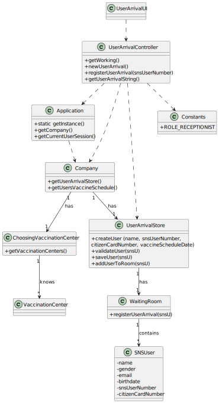

# US 04 - Register the Arrival of a SNS user to take the vaccine.

## 1. Requirements Engineering

### 1.1. User Story Description

As a **Receptionist** at a vaccination center, I want to register 
the arrival of a **SNS user** to take the vaccine.

### 1.2. Customer Specifications and Clarifications 

**From the specifications document:**
>On the scheduled day and time, the SNS user should go to the vaccination center to get the vaccine. When the SNS user arrives at the vaccination center, a receptionist registers the arrival of the user to take the respective vaccine. The receptionist asks the SNS user for his/her SNS user number and confirms that he/she has the vaccine scheduled for the that day and time. If the information is correct, the receptionist acknowledges the system that the user is ready to take the vaccine.

**From the client specifications:**

> Question: "Regarding US04, what are the attributes needed in order to register the arrival of a SNS user to a vaccination center."
>
> Answer: "The time of arrival should be registered."

> Question: "Regarding US04, a receptionist register the arrival of a SNS user immediately when he arrives at the vaccination center or only after the receptionist confirms that the respective user has a vaccine schedule for that day and time."
>
> Answer: "The receptionist registers the arrival of a SNS user only after confirming that the user has a vaccine scheduled for that day and time."

> Question: "When the SNS user number is introduce by the receptionist and the system has no appointment for that SNS user number, how should the system proceed?"
>
> Answer: "The application should present a message saying that the SNS user did not scheduled a vaccination."

>Question: "Respectively to US04, after the receptionist registers the SNS User's arrival at the Vaccination Center, the system creates the list that will be available for the Nurse to view, correct? "
>
>Answer: "The nurse checks the list (of SNS users in the waiting room) in US05."
 
### 1.3. Acceptance Criteria

* **AC1:** No duplicate entries should be possible for the same SNS
user on the same day or vaccine period.

### 1.4. Found out Dependencies

* There is a dependency to "US1 Schedule a Vaccine as a SNS User" because in order to send the user to the waiting room, the receptionist must verify his appointment.

### 1.5 Input and Output Data

**Input Data:**

* Typed data:
    * SNS user number

* Selected data:
    * Center selection
  
  
**Output Data:**

* (In)Success of the operation

### 1.6. System Sequence Diagram (SSD)

### 1.7 Other Relevant Remarks

n/a

## 2. OO Analysis

### 2.1. Relevant Domain Model Excerpt 

### 2.2. Other Remarks

n/a

## 3. Design - User Story Realization 

### 3.1. Rationale

**The rationale grounds on the SSD interactions and the identified input/output data.**

| Interaction ID | Question: Which class is responsible for...    | Answer                              | Justification (with patterns)                                                                                 |
|:---------------|:-----------------------------------------------|:------------------------------------|:--------------------------------------------------------------------------------------------------------------|
| Step 1  		     | 	... interacting with the actor?               | ChoosingVaccinationCenterUI         | Pure Fabrication: there is no reason to assign this responsibility to any existing class in the Domain Model. |
| 			  		        | 	... coordinating the UI?                      | ChoosingVaccinationCenterController | Controller                                                                                                    |
| 		             | 	... knowing the company?						                | App                                 | Creator : Has the data needed to initialize Company                                                           |
| 			 	          | 	   ... knowing the list of Centers            | VaccinationCenterStore              | IE: where list was filled                                                                                     |
| 			  	Step 2	  | 	                                              |                                     |                                                                                                               | 
| Step 3  		     | 	... knowing the user using the system         | UserSession                         | IE: Documentation                                                                                             |                                                             |
| 		             | 	... setting and employee to a specific Center | Employee                            | IE: owns the information of the Center                                                                        |
| Step 5 		      | 	... interacting with the actor?               | UserArrivalUI                       | Pure Fabrication: there is no reason to assign this responsibility to any existing class in the Domain Model. |
| 			  		        | 	... coordinating the US?                      | UserArrivalController               | Controller                                                                                                    |                                                           |
| Step 6  		     | 		... knowing where the employee works					    | Employee                            | IE: knows the center that he is working                                                                       |
| Step 7  		     | 	                                              |                                     |                                                                                                               |                                           |
| Step 8  		     | 	... knowing the list of Schedule Vaccines     | ScheduleVaccineStore                | IE: owns the vaccine schedules                                                                                |
| Step 9 		      | 	... Validating User Schedule                  | UserArrivalStore                    | IE: Knows the lists and the user                                                                              |
| Step 10 		     | 			... informing operation success				         | UserArrivalUI                       | IE: is responsible for user interactions                                                                      |              

### Systematization ##

According to the taken rationale, the conceptual classes promoted to software classes are: 

 * Application
 * Company
 * UserArrivalStore
 * UserSession
 * Receptionist

Other software classes (i.e. Pure Fabrication) identified: 
 * UserArrivalUI  
 * UserArrivalController
 * ChoosingVaccinationCenterUI
 * ChoosingVaccinationCenterController

Other classes of the system:
* UserSession
* Constants

## 3.2. Sequence Diagram (SD)

*In this section, it is suggested to present an UML dynamic view stating the sequence of domain related software objects' interactions that allows to fulfill the requirement.* 

## 3.3. Class Diagram (CD)

*In this section, it is suggested to present an UML static view representing the main domain related software classes that are involved in fulfilling the requirement as well as and their relations, attributes and methods.*

# 4. Tests 
*In this section, it is suggested to systematize how the tests were designed to allow a correct measurement of requirements fulfilling.* 

**_DO NOT COPY ALL DEVELOPED TESTS HERE_**

**Test 1:** Check that it is not possible to create an instance of the Example class with null values. 

	@Test(expected = IllegalArgumentException.class)
		public void ensureNullIsNotAllowed() {
		Exemplo instance = new Exemplo(null, null);
	}

*It is also recommended to organize this content by subsections.* 

# 5. Construction (Implementation)

## Class UserArrivalUI

    public UserArrivalUI() {

        this.controller = new UserArrivalController();
    }

    public void run() {

        if (controller.getWorking() == null) {
            System.out.println("Doesn't exist");
        } else {
            String snsUserNumber = Utils.readLineFromConsole("SNS User Number");
            if (inputData(snsUserNumber)) {

            //    Object o = Utils.showAndSelectOne(controller.getVaccineTypeList(), "\nVaccineTypes: ");
              //  ScheduleVaccine scheduleVaccine = controller.getScheduleVaccine(snsUserNumber, (VaccineType) o);
              //  getData();

                //if (Utils.confirm("Confirms data?(s/n)")) {
                    controller.registerUserArrival();
                    System.out.println("SNS User arrival registered successfully");
                //} else
                    //run();

            } else {
                System.out.println("not a valid user or already exists");
            }
        }

    }

    private boolean inputData(String snsUserNumber) {

        return controller.newUserArrival(snsUserNumber);
    }

## Class UserArrivalController

    public UserArrivalController() {
        this.oApp = App.getInstance();
        this.oCompany = oApp.getCompany();
        this.vaccineTypeStore = oCompany.getVaccineTypeStore();
        this.vaccineScheduleStore =oCompany.getScheduleVaccineStore();
    }

    /**
     * Get working vaccination center.
     *
     * @return the vaccination center
     */
    public VaccinationCenter getWorking() {
        vaccinationCenter = oCompany.getEmployeeStore().getWorking(oApp.getCurrentUserSession().getUserId().getEmail());
        return vaccinationCenter;
    }

    /**
     * New user arrival boolean.
     *
     * @param snsUserNumber the sns user number
     * @return the boolean
     */
    public boolean newUserArrival(String snsUserNumber) {
        this.userArrival = oCompany.getUserArrivalStore().newUserArrival(oCompany.getSNSUserStore().getSNSUserByNumber(snsUserNumber), snsUserNumber, vaccinationCenter);

        if (this.userArrival != null)
            return true;
        else
            return false;
    }

    /**
     * Register user arrival boolean.
     *
     * @return the boolean
     */
    public boolean registerUserArrival() {
        return this.oCompany.getUserArrivalStore().registerUserArrival(this.userArrival);
    }

    /**
     * Gets user arrival string.
     *
     * @return the user arrival string
     */
    public String getUserArrivalString() {
        return this.oSNSUser.toStringWaitingRoom();
    }

# 6. Integration and Demo 

new features to the receptionist

# 7. Observations

Harder sprint with some difficulties thanks to new concepts presented

