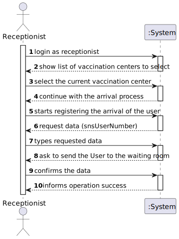
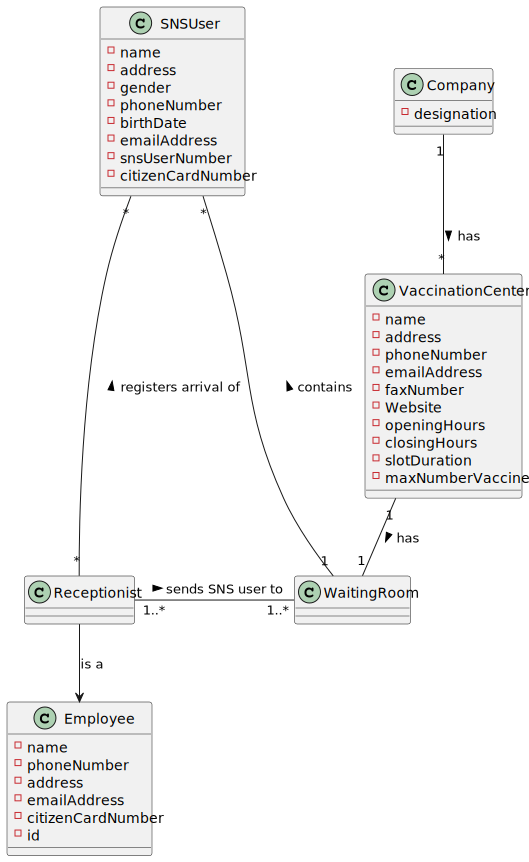
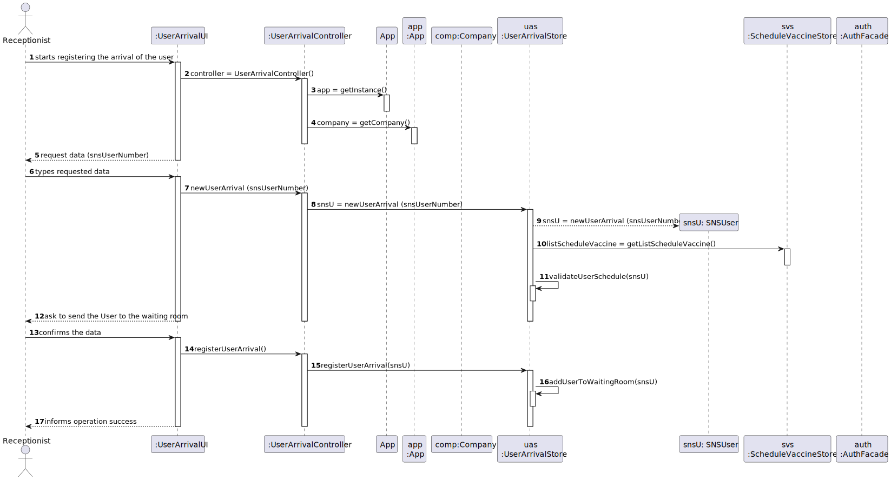

# US 04 - Register the Arrival of a SNS user to take the vaccine.

## 1. Requirements Engineering

### 1.1. User Story Description

As a **Receptionist** at a vaccination center, I want to register 
the arrival of a **SNS user** to take the vaccine.

### 1.2. Customer Specifications and Clarifications 

> Question: "Regarding US04, what are the attributes needed in order to register the arrival of a SNS user to a vaccination center."
>
> Answer: "The time of arrival should be registered."

> Question: "Regarding US04, a receptionist register the arrival of a SNS user immediately when he arrives at the vaccination center or only after the receptionist confirms that the respective user has a vaccine schedule for that day and time."
>
> Answer: "The receptionist registers the arrival of a SNS user only after confirming that the user has a vaccine scheduled for that day and time."

> Question: "When the SNS user number is introduce by the receptionist and the system has no appointment for that SNS user number, how should the system proceed?"
>
> Answer: "The application should present a message saying that the SNS user did not scheduled a vaccination."

> Question: "Regarding US02, i would like to know if a receptionist has the ability to schedule an appointment in different vaccination centres or only on their own."
>
> Answer: "The receptionist has the ability to schedule the vaccine in any vaccination center. The receptionist should ask the SNS user to indicate/select the preferred vaccination center."

>Question: "Respectively to US04, after the receptionist registers the SNS User's arrival at the Vaccination Center, the system creates the list that will be available for the Nurse to view, correct? "
>
>Answer: "The nurse checks the list (of SNS users in the waiting room) in US05."
 
### 1.3. Acceptance Criteria

* **AC1:** No duplicate entries should be possible for the same SNS
user on the same day or vaccine period.

### 1.4. Found out Dependencies

* There is a dependency to "US1 Schedule a Vaccine as a SNS User" because in order to send the user to the waiting room, the receptionist must verify his appointment.

### 1.5 Input and Output Data

**Input Data:**

* Typed data:
    * Name
    * Vaccine Schedule Date
    * Arrival Time
    * Citizen Card Number
    * SNS user number

* Selected data:
    * n/a
  

**Output Data:**

* (In)Success of the operation

### 1.6. System Sequence Diagram (SSD)

### 1.7 Other Relevant Remarks

n/a

## 2. OO Analysis

### 2.1. Relevant Domain Model Excerpt 

### 2.2. Other Remarks

n/a

## 3. Design - User Story Realization 

### 3.1. Rationale

**The rationale grounds on the SSD interactions and the identified input/output data.**

| Interaction ID | Question: Which class is responsible for...        | Answer                | Justification (with patterns)                                                                                 |
|:---------------|:---------------------------------------------------|:----------------------|:--------------------------------------------------------------------------------------------------------------|
| Step 1  		     | 	... interacting with the actor?                   | UserArrivalUI         | Pure Fabrication: there is no reason to assign this responsibility to any existing class in the Domain Model. |
| 			  		        | 	... coordinating the US?                          | UserArrivalController | Controller                                                                                                    |                                                           |
| Step 2  		     | 							                                            |                       |                                                                                                               |
| Step 3  		     | 	... creating the instance of the sns user arrival | Company               | Creator: in the DM Company has a Task.                                                                        | IE: object created in step 1 has its own data.                                                                |
| Step 4  		     | 	...knowing the task categories to show?           | Platform              | IE: Task Categories are defined by the Platform.                                                              |
| Step 5  		     | 	... saving the selected category?                 | Task                  | IE: object created in step 1 is classified in one Category.                                                   |
| Step 6  		     | 							                                            |                       |                                                                                                               |              
| Step 7  		     | 	... validating all data (local validation)?       | UserArrivalStore      | IE: owns its data.                                                                                            | 
| 			  		        | 	... validating all data (global validation)?      | UserArrivalStore      | IE: knows all its tasks.                                                                                      | 
| 			  		        | 	... saving the created task?                      | UserArrivalStore      | IE: owns all its tasks.                                                                                       | 
| Step 8  		     | 	... informing operation success?                  | UserArrivalUI         | IE: is responsible for user interactions.                                                                     | 

### Systematization ##

According to the taken rationale, the conceptual classes promoted to software classes are: 

 * Application
 * Company
 * UserArrivalStore

Other software classes (i.e. Pure Fabrication) identified: 
 * UserArrivalUI  
 * UserArrivalController

## 3.2. Sequence Diagram (SD)

*In this section, it is suggested to present an UML dynamic view stating the sequence of domain related software objects' interactions that allows to fulfill the requirement.* 

## 3.3. Class Diagram (CD)

*In this section, it is suggested to present an UML static view representing the main domain related software classes that are involved in fulfilling the requirement as well as and their relations, attributes and methods.*

# 4. Tests 
*In this section, it is suggested to systematize how the tests were designed to allow a correct measurement of requirements fulfilling.* 

**_DO NOT COPY ALL DEVELOPED TESTS HERE_**

**Test 1:** Check that it is not possible to create an instance of the Example class with null values. 

	@Test(expected = IllegalArgumentException.class)
		public void ensureNullIsNotAllowed() {
		Exemplo instance = new Exemplo(null, null);
	}

*It is also recommended to organize this content by subsections.* 

# 5. Construction (Implementation)

*In this section, it is suggested to provide, if necessary, some evidence that the construction/implementation is in accordance with the previously carried out design. Furthermore, it is recommeded to mention/describe the existence of other relevant (e.g. configuration) files and highlight relevant commits.*

*It is also recommended to organize this content by subsections.* 

# 6. Integration and Demo 

*In this section, it is suggested to describe the efforts made to integrate this functionality with the other features of the system.*

# 7. Observations

*In this section, it is suggested to present a critical perspective on the developed work, pointing, for example, to other alternatives and or future related work.*

