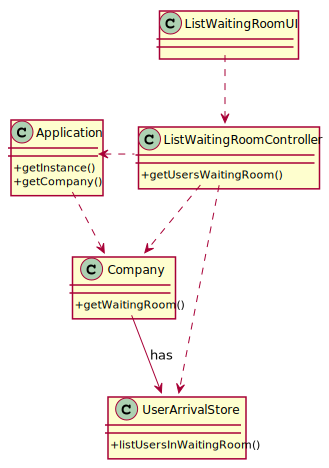

# US 04 - Register the Arrival of a SNS user to take the vaccine.

## 1. Requirements Engineering

### 1.1. User Story Description

As a **Nurse** e, I intend to consult the **users** in the waiting room of a vacination center.

### 1.2. Customer Specifications and Clarifications 

> Question: "Regarding the US05. In the PI description it is said that, by now, the nurses and the receptionists will work at any center. Will this information remain the same on this Sprint, or will they work at a specific center?"
>
> Answer: "Nurses and receptionists can work in any vaccination center."

> Question: "I would like to know which are the attributes of the waiting room"
>
> Answer: "The waiting room will not be registered or defined in the system. The waiting room of each vaccination center has the capacity to receive all users who take the vaccine on given slot."
  
> Question: "We need to know if the nurse have to chose the vaccination center before executing the list or if that information comes from employee file?"
>
> Answer: "When the nurse starts to use the application, firstly, the nurse should select the vaccination center where she his working. The nurse wants to check the list of SNS users that are waiting in the vaccination center where she his working."

> Question: "Regarding US 05, what does consulting constitute in this context? Does it refer only to seeing who is present and deciding who gets the vaccine or is checking the user info to administer the vaccine, registering the process, and sending it to the recovery room also part of this US?"
>
> Answer: "The goal is to check the list of users that are waiting and ready to take the vaccine."

 
### 1.3. Acceptance Criteria

* **AC1:** SNS Users’ list should be presented by order of arrival.

### 1.4. Found out Dependencies

* There is a dependency to "US4 register the arrival of a SNS user
  to take the vaccine." because in order to list the Users in the waiting room, the receptionist has to register their arrival.

### 1.5 Input and Output Data

**Input Data:**

* Typed data:
    * n/a

* Selected data:
    * n/a
  

**Output Data:**

* List of the SNS Users that are currently in the waiting room.

### 1.6. System Sequence Diagram (SSD)

### 1.7 Other Relevant Remarks

n/a

## 2. OO Analysis

### 2.1. Relevant Domain Model Excerpt 

### 2.2. Other Remarks

n/a

## 3. Design - User Story Realization 

### 3.1. Rationale

**The rationale grounds on the SSD interactions and the identified input/output data.**

| Interaction ID | Question: Which class is responsible for...        | Answer                | Justification (with patterns)                                                                                 |
|:---------------|:---------------------------------------------------|:----------------------|:--------------------------------------------------------------------------------------------------------------|
| Step 1  		     | 	... interacting with the actor?                   | UserArrivalUI         | Pure Fabrication: there is no reason to assign this responsibility to any existing class in the Domain Model. |
| 			  		        | 	... coordinating the US?                          | UserArrivalController | Controller                                                                                                    |                                                           |
| Step 2  		     | 							                                            |                       |                                                                                                               |
| Step 3  		     | 	... creating the instance of the sns user arrival | Company               | Creator: in the DM Company has a Task.                                                                        | IE: object created in step 1 has its own data.                                                                |
| Step 4  		     | 	...knowing the task categories to show?           | Platform              | IE: Task Categories are defined by the Platform.                                                              |
| Step 5  		     | 	... saving the selected category?                 | Task                  | IE: object created in step 1 is classified in one Category.                                                   |
| Step 6  		     | 							                                            |                       |                                                                                                               |              
| Step 7  		     | 	... validating all data (local validation)?       | UserArrivalStore      | IE: owns its data.                                                                                            | 
| 			  		        | 	... validating all data (global validation)?      | UserArrivalStore      | IE: knows all its tasks.                                                                                      | 
| 			  		        | 	... saving the created task?                      | UserArrivalStore      | IE: owns all its tasks.                                                                                       | 
| Step 8  		     | 	... informing operation success?                  | UserArrivalUI         | IE: is responsible for user interactions.                                                                     | 

### Systematization ##

According to the taken rationale, the conceptual classes promoted to software classes are: 

 * Application
 * Company
 * UserArrivalStore

Other software classes (i.e. Pure Fabrication) identified: 
 * UserArrivalUI  
 * UserArrivalController

## 3.2. Sequence Diagram (SD)

*In this section, it is suggested to present an UML dynamic view stating the sequence of domain related software objects' interactions that allows to fulfill the requirement.* 

## 3.3. Class Diagram (CD)

*In this section, it is suggested to present an UML static view representing the main domain related software classes that are involved in fulfilling the requirement as well as and their relations, attributes and methods.*

# 4. Tests 
*In this section, it is suggested to systematize how the tests were designed to allow a correct measurement of requirements fulfilling.* 

**_DO NOT COPY ALL DEVELOPED TESTS HERE_**

**Test 1:** Check that it is not possible to create an instance of the Example class with null values. 

	@Test(expected = IllegalArgumentException.class)
		public void ensureNullIsNotAllowed() {
		Exemplo instance = new Exemplo(null, null);
	}

*It is also recommended to organize this content by subsections.* 

# 5. Construction (Implementation)

*In this section, it is suggested to provide, if necessary, some evidence that the construction/implementation is in accordance with the previously carried out design. Furthermore, it is recommeded to mention/describe the existence of other relevant (e.g. configuration) files and highlight relevant commits.*

*It is also recommended to organize this content by subsections.* 

# 6. Integration and Demo 

*In this section, it is suggested to describe the efforts made to integrate this functionality with the other features of the system.*

# 7. Observations

*In this section, it is suggested to present a critical perspective on the developed work, pointing, for example, to other alternatives and or future related work.*

