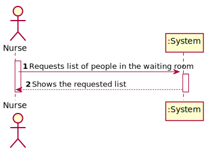
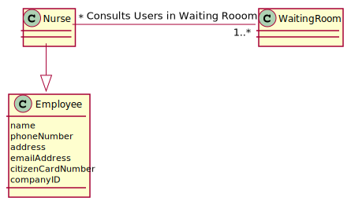
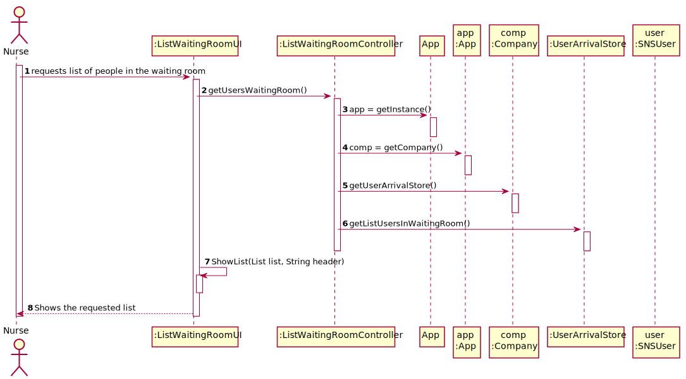

# US 05 - Consult a list of the Users In the Waiting Room.

## 1. Requirements Engineering

### 1.1. User Story Description

As a **Nurse** e, I intend to consult the **users** in the waiting room of a vacination center.

### 1.2. Customer Specifications and Clarifications 

> Question: "Regarding the US05. In the PI description it is said that, by now, the nurses and the receptionists will work at any center. Will this information remain the same on this Sprint, or will they work at a specific center?"
>
> Answer: "Nurses and receptionists can work in any vaccination center."

> Question: "I would like to know which are the attributes of the waiting room"
>
> Answer: "The waiting room will not be registered or defined in the system. The waiting room of each vaccination center has the capacity to receive all users who take the vaccine on given slot."
  
> Question: "We need to know if the nurse have to chose the vaccination center before executing the list or if that information comes from employee file?"
>
> Answer: "When the nurse starts to use the application, firstly, the nurse should select the vaccination center where she his working. The nurse wants to check the list of SNS users that are waiting in the vaccination center where she his working."

> Question: "Regarding US 05, what does consulting constitute in this context? Does it refer only to seeing who is present and deciding who gets the vaccine or is checking the user info to administer the vaccine, registering the process, and sending it to the recovery room also part of this US?"
>
> Answer: "The goal is to check the list of users that are waiting and ready to take the vaccine."

 
### 1.3. Acceptance Criteria

* **AC1:** SNS Users’ list should be presented by order of arrival.

### 1.4. Found out Dependencies

* There is a dependency to "US4 register the arrival of a SNS user
  to take the vaccine." because in order to list the Users in the waiting room, the receptionist has to register their arrival in the UserArrivalStore.

### 1.5 Input and Output Data

**Input Data:**

* Typed data:
    * n/a

* Selected data:
  * Show list of the SNS Users that are currently in the waiting room.
  

**Output Data:**

* List of the SNS Users that are currently in the waiting room.

### 1.6. System Sequence Diagram (SSD)

### 1.7 Other Relevant Remarks

* Before Showing the Options list for the employee (Nurse), the system asks where the Employee works.

## 2. OO Analysis

### 2.1. Relevant Domain Model Excerpt 

### 2.2. Other Remarks

n/a

## 3. Design - User Story Realization 

### 3.1. Rationale

**The rationale grounds on the SSD interactions and the identified input/output data.**

| Interaction ID | Question: Which class is responsible for...        | Answer                | Justification (with patterns)                                                                                 |
|:---------------|:---------------------------------------------------|:----------------------|:--------------------------------------------------------------------------------------------------------------|
| Step 1  		     | 	... interacting with the actor?                   | ListWaitingRoomUI         | Pure Fabrication: there is no reason to assign this responsibility to any existing class in the Domain Model. |
| 			  		        | 	... coordinating the US?                          | ListWaitingRoomController | Controller                                                                                                    |                                                           |
| 		     | 	... creating the instance of the sns user arrival | Company               | Creator: in the DM Company has a Task.                                                                        | IE: object created in step 1 has its own data.                                                                |
|  		     | 	...knowing the task categories to show?           | Company              | IE: Task Categories are defined by the Platform.                                                              |
| 		     | 	... returning the Users In Waiting Room List              | UserArrivalStore                  | IE: object created in step 2 is classified as Store.                                                  |
| 		     | 							                                            |                       |                                                                                                               |              
| Step 2		     | 	... Listing the Users (Final Step)      | ListWaitingRoomUI     | IE: UI is responsible for the interactions with the user.                                                                                          |

### Systematization ##

According to the taken rationale, the conceptual classes promoted to software classes are: 

 * Application
 * Company
 * UserArrivalStore

Other software classes (i.e. Pure Fabrication) identified: 
 * ListWaitingRoomUI  
 * ListWaitingRoomController

## 3.2. Sequence Diagram (SD)

*Note: The first Sequence Diagram IS about the US5. The second Sequence Diagram Was made to explain the process before the beginning of the US (where the Employee that logged in selects the vaccination center that he/she works.)*

### 3.2.2 Second Sequence Diagram (SDv2)

## 3.3. Class Diagram (CD)

# 4. Tests 
*In this section, it is suggested to systematize how the tests were designed to allow a correct measurement of requirements fulfilling.* 

**_DO NOT COPY ALL DEVELOPED TESTS HERE_**

**Test 1:** Check that the Controller is listing correctly

	@Test
    public void getListUsersInWaitingRoom() throws ParseException {
        Date dtest = new SimpleDateFormat("dd/MM/yyyy").parse("02/05/2003");
        SNSUser user = new SNSUser("Test","male",dtest ,"street test", "923456789","user@test.com","123453678","12345342");
        String numero = user.getSnsUserNumber();
        cont.newUserArrival(numero);
        List<SNSUser> Users = new ArrayList<>();
        Users.add(user);

        assertEquals(Users , controller.getListUsersInWaitingRoom());

# 5. Construction (Implementation)

##Class ListWaitingRoomUI 

    public ListWaitingRoomUI() {controller = new ListWaitingRoomController();}

    public void run() {
        listUsersInWaitingRoom();
    }

    private void listUsersInWaitingRoom(){

        Utils.showList(controller.getListUsersInWaitingRoom(),"List of SNS Users in the Waiting Room");
    }
}

##Class ListWaitingRoomController

    public ListWaitingRoomController() {
    this.oApp = App.getInstance();
    }

  
    public List<SNSUser>  getListUsersInWaitingRoom() {
        return this.oApp.getCompany().getUserArrivalStore().getListUserToWaitingRoom(getWorking());
    }

# 6. Integration and Demo 

Employee's working place (vaccination center) was implemented in this Sprint to choose wich vaccination center to manage individually.

# 7. Observations

Harder sprint with some difficulties thanks to new concepts presented

