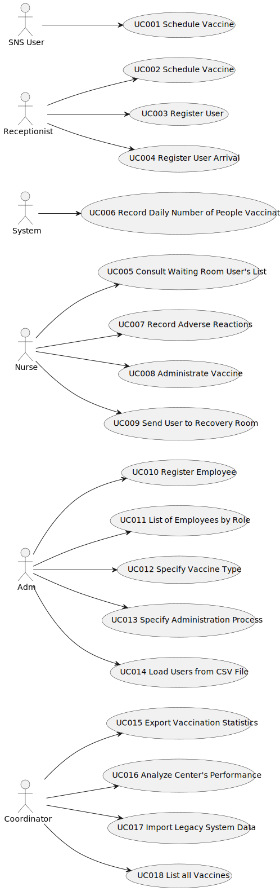

# Use Case Diagram (UCD)

**In the scope of this project, there is a direct relationship of _1 to 1_ between Use Cases (UC) and User Stories (US).**

However, be aware, this is a pedagogical simplification. On further projects and curricular units might also exist _1 to N **and/or** N to 1 relationships between US and UC.

# Use Cases / User Stories
| UC/US  | Description                                          |                   
|:-------|:-----------------------------------------------------|
| US 001 | [Schedule Vaccine](US1.md)                           |
| US 002 | [Schedule Vaccine as Receptionist](US002.md)         |
| US 003 | [Register User](US003.md)                            |
| US 004 | [Register User Arrival](US004.md)                    |
| US 005 | [Consult Waiting Room User's List](US005.md)         |
| US 006 | [Record Daily Number of People Vaccinated](US006.md) |
| US 007 | [Record Adverse Reactions](US007.md)                 |
| US 008 | [Administrate Vaccine](US008.md)                     |
| US 009 | [Register Vaccination Center](US009.md)              |
| US 010 | [Register Employee](US010.md)                        |
| US 011 | [List of Employees by Role](US011.md)                |
| US 012 | [Specify Vaccine Type](US012.md)                     |
| US 013 | [Specify Administration Process](US13.md)            |
| US 014 | [Load Users from CSV File](US014.md)                 |
| US 015 | [Export Vaccination Statistics](US015.md)            |
| US 016 | [Analyze Center's Performance](US016.md)             |
| US 017 | [Import Legacy System Data](US017.md)                |
| US 018 | [List all Vaccines](US018.md)                        |