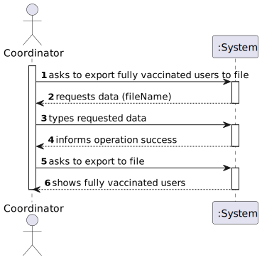
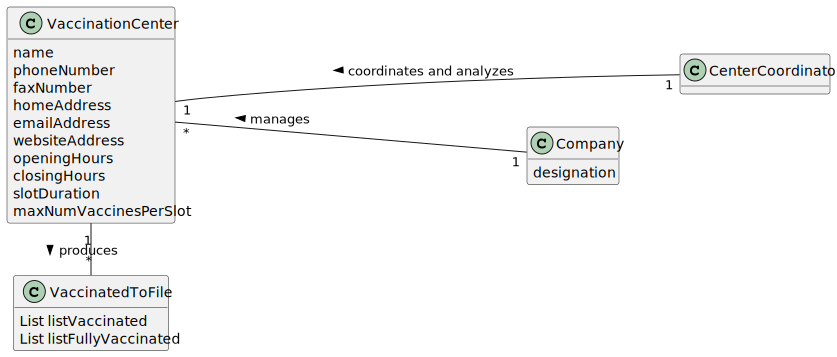
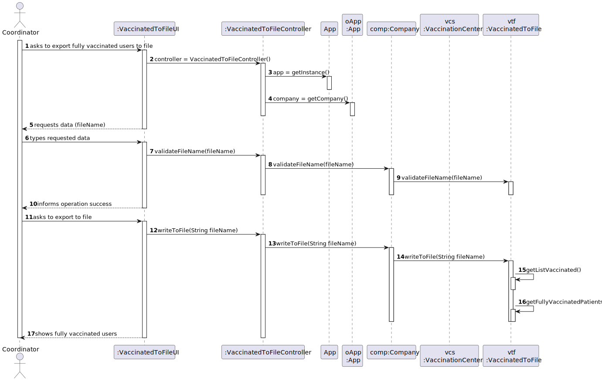
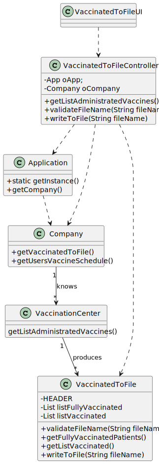

# US 15 - Check and Export Vaccination Statistics

## 1. Requirements Engineering

### 1.1. User Story Description

As a **Center Coordinator**, I intend to check and export vaccination statistics

### 1.2. Customer Specifications and Clarifications 

**From the client clarifications:**

> **Question:** Which is the unit of measurement used to estimate duration?
>  
> **Answer:** Duration is estimated in days.

-

> **Question:** Monetary data is expressed in any particular currency?
>  
> **Answer:** Monetary data (e.g. estimated cost of a task) is indicated in POTs (virtual currency internal to the platform).

### 1.3. Acceptance Criteria

n/a

### 1.4. Found out Dependencies

* There is a dependency to "US8 Administrate Vaccine" because, in order to check the fully vaccinated patients, we need to access the vaccinated users in the center

### 1.5 Input and Output Data

**Input Data:**

* Typed data:
	* a file name
	
* Selected data:
	n/a

**Output Data:**

* List of the fully vaccinated users
* File with that list
* (In)Success of the operation

### 1.6. System Sequence Diagram (SSD)

**Alternative 1**

### 1.7 Other Relevant Remarks

n
7a

## 2. OO Analysis

### 2.1. Relevant Domain Model Excerpt 

### 2.2. Other Remarks

n/a

## 3. Design - User Story Realization 

### 3.1. Rationale

**SSD - Alternative 1 is adopted.**

| Interaction ID | Question: Which class is responsible for... | Answer                     | Justification (with patterns)  |
|:---------------|:--------------------- |:---------------------------|:---------------------------- |
| Step 1  		     |	... interacting with the actor? | VaccinatedToFileUI         |  Pure Fabrication: there is no reason to assign this responsibility to any existing class in the Domain Model.           |
| 			  		        |	... coordinating the US? | VaccinatedToFileController | Controller                             |
| 			  		        |	... instantiating a new Task? | Company                    | Creator (Rule 1): in the DM Organization has a Task.   |
| 			  		        |							 | Organization               | IE: knows/has its own Employees|
| 			  		        |							 | Employee                   | IE: knows its own data (e.g. email) |
| Step 2  		     |							 |                            |                              |
| Step 3  		     |	...saving the inputted data? | Task                       | IE: object created in step 1 has its own data.  |
| Step 4  		     |	...knowing the task categories to show? | Platform                   | IE: Task Categories are defined by the Platform. |
| Step 5  		     |	... validating all data (local validation)? | Task                       | IE: owns its data.| 
| 			  		        |	... validating all data (global validation)? | Organization               | IE: knows all its tasks.| 
| 			  		        |	... saving the created task? | Organization               | IE: owns all its tasks.| 
| Step 6  		     |	... informing operation success?| VaccinatedToFileUI         | IE: is responsible for user interactions.  | 

### Systematization ##

According to the taken rationale, the conceptual classes promoted to software classes are: 

 * VaccinatedToFile

Other software classes (i.e. Pure Fabrication) identified: 

 * VaccinatedToFileUI  
 * VaccinatedToFileController

## 3.2. Sequence Diagram (SD)

**Alternative 1**

## 3.3. Class Diagram (CD)

**From alternative 1**

# 4. Tests 

**Test 1:** Check that it is not possible to create an instance of the Task class with null values. 

	@Test(expected = IllegalArgumentException.class)
		public void ensureNullIsNotAllowed() {
		Task instance = new Task(null, null, null, null, null, null, null);
	}
	

**Test 2:** Check that it is not possible to create an instance of the Task class with a reference containing less than five chars - AC2. 

	@Test(expected = IllegalArgumentException.class)
		public void ensureReferenceMeetsAC2() {
		Category cat = new Category(10, "Category 10");
		
		Task instance = new Task("Ab1", "Task Description", "Informal Data", "Technical Data", 3, 3780, cat);
	}

*It is also recommended to organize this content by subsections.* 

# 5. Construction (Implementation)

## Class CreateTaskController 

    public VaccinatedToFileController() {
        oApp = App.getInstance();
        oCompany = oApp.getCompany();
    }

    public List getListAdministratedVaccines() {
        return VaccinationCenter.getListAdministratedVaccines();
    }

    public boolean validateFileName(String fileName) {
        return oCompany.getVaccinatedToFile().validateFileName(fileName);
    }

    public void writeToFile(String fileName) throws Exception {
        oCompany.getVaccinatedToFile().writeToFile(fileName);
    }

## Class Organization

		public boolean validateFileName(String fileName) {
        try {
            File myObj = new File(fileName);
            if (myObj.createNewFile()) {
                return true;
            } else {
                return false;
            }
        } catch (IOException e) {
            return false;
        }
    }

    public List getFullyVaccinatedPatients() {
        for (int i = 0; i < listVaccinated.size(); i++) {
            if (Collections.frequency(listVaccinated, listVaccinated.get(i)) == 1) {
                listFullyVaccinated.add(listVaccinated.get(i));
            }
        }
        return listFullyVaccinated;
    }

    public List getListVaccinated() {
        return VaccinationCenter.getListAdministratedVaccines();
    }

    public void writeToFile(String fileName) throws Exception {
        FileWriter writer = null;
        try {
            writer = new FileWriter(fileName);

            listVaccinated = getListVaccinated();
            listFullyVaccinated = getFullyVaccinatedPatients();
            
            System.out.println(HEADER + "\n");
            System.out.println(listFullyVaccinated.size());
            System.out.printf(String.valueOf(listFullyVaccinated));

            writer.write(HEADER);
            writer.write(SEPARATOR+SEPARATOR);
            writer.write(listFullyVaccinated.size()+" Users Vaccinated");
            writer.write(SEPARATOR);
            writer.write(String.valueOf(listFullyVaccinated));

        } catch (Exception e) {
            throw new Exception("couldn´t write on the file");
        } finally {
            writer.close();
        }

    }

# 6. Integration and Demo 

options.add(new MenuItem("Export Vaccination Statistics", new VaccinatedToFileUI()));

# 7. Observations

Platform and Organization classes are getting too many responsibilities due to IE pattern and, therefore, they are becoming huge and harder to maintain. 

Is there any way to avoid this to happen?

* divide responsibilities with other classes

