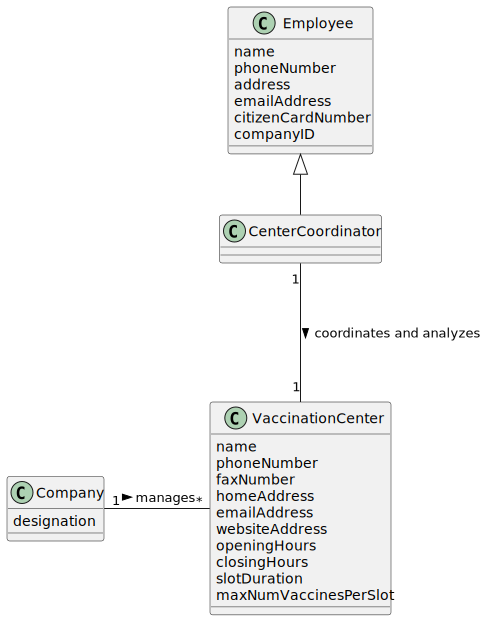
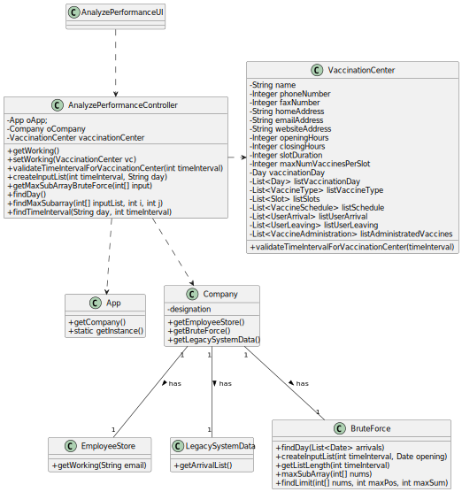

# US 14 - Analyze the performance of a center, as a Center Coordinator
## 1. Requirements Engineering

### 1.1. User Story Description

As a center coordinator, I intend to analyze the performance of a center.

### 1.2. Customer Specifications and Clarifications

**From the client clarifications:**

> **Question:** Is the time of departure of an SNS user the time he got vaccinated plus the recovery time or do we have another way of knowing it?
>
> **Answer:** The time of departure of an SNS user is the time he got vaccinated plus the recovery time.

> **Question:** In US 16, should the coordinator have the option to choose which algorithm to run (e.g. via a configuration file or while running the application) in order to determine the goal sublist, or is the Benchmark Algorithm strictly for drawing comparisons with the Bruteforce one?
>
> **Answer:** The algorithm to run should be defined in a configuration file.

> **Question:** I would like to ask that if to analyse the performance of a center, we can assume (as a pre requirement) that the center coordinator was already attributed to a specific vaccination center and proceed with the US as so (like the center coordinator does not have to choose at a certain point where he is working. This is already treated before this US happens)
>
> **Answer:** A center coordinator can only coordinate one vaccination center. The center coordinator can only analyze the performance of the center that he coordinates.

> **Question:** I would like to know if we could strict the user to pick only those intervals (m) (i.e. 1, 5, 10, 20, 30) as options for analyzing the performance of a center, since picking intervals is dependent on the list which is 720/m (which the length is an integer result). If we let the user pick an interval that results in a non-integer result, this will result in an invalid list since some data for the performance analysis will be lost. Can you provide a clarification on this situation?
>
> **Answer:** The user can introduce any interval value. The system should validate the interval value introduced by the user.

### 1.3. Acceptance Criteria

* **AC1:** The application must support two types of algorithms: 
  a) Benchmark Algorithm; b) BruteForce Algorithm.

### 1.4. Found out Dependencies

* There is a dependency to class "LegacySystemData", we need to read both arrival and leaving lists.

### 1.5 Input and Output Data

**Input Data:**

* Typed data:
    * Time interval

**Output Data:**

* Input Array
* Contiguous sublist with maximum sum
* Maximum sum
* Time interval

### 1.6. System Sequence Diagram (SSD)

**Alternative 1**

### 1.7 Other Relevant Remarks

N/A

## 2. OO Analysis

### 2.1. Relevant Domain Model Excerpt

### 2.2. Other Remarks

n/a

## 3. Design - User Story Realization

### 3.1. Rationale

**SSD - Alternative 1 is adopted.**

| Interaction ID | Question: Which class is responsible for... | Answer  | Justification (with patterns)  |
|:-------------  |:--------------------- |:------------|:---------------------------- |
| Step 1  		 |	... interacting with the actor? | AnalyzePerformanceUI   |  Pure Fabrication: there is no reason to assign this responsibility to any existing class in the Domain Model.           |
| 			  		 |	... coordinating the US? | AnalyzePerformanceController | Controller                             |
|  		 |	... knowing the app instance? | App   |  Creator(Rule 3): App closely uses Singleton  |
|   		 |	... knowing the company? | App   |  Creator(Rule 4): App has all the data used to initialize the Company           |
|   		 |	... knowing all Employees? | EmployeeStore   |  HC + LC: knows/has all its Employees.         |
|   		 |	... knowing the Vaccination Center where the Employee works? | EmployeeStore   |  HC + LC: knows/has all its Employees.        |
|   		 |	... has LegacySystemData? | Company   |  Company.         |
|   		 |	... knowing the Arrival List? | LegacySystemData   |  HC + LC: knows/has all its Legacy System Data.          |
|   		 |	... has Bruteforce algorithm? | Company   |  Company.         |
|   		 |	... finds day from imported Legacy File? | BruteForce   |  IE: Bruteforce reads the Legacy File and finds the date.         |
| Step 2		 | 	 |    |    |
| Step 3  		 |	... validates time interval? | VaccinationCenter  | IE: owns its data.  |
|   		 |	... creates input list? | BruteForce  | IE: Bruteforce creates input array.  |
|   		 |	... knows input list length? | BruteForce  | HC + LC: knows/has its own data.  |
|   		 |	... gets maximum subarray information? | BruteForce  | IE: Bruteforce analyzes input array and returns information about it. |
|   		 |	... finds maximum subarray? | AnalyzePerformanceController  | IE: uses information from the previous step to find the subarray inside the input array.  |
|   		 |	... finds the time interval? | AnalyzePerformanceController  | 	IE: uses information from the previous step to find the time interval.  |
| Step 4  		 |	 |   |  |
### Systematization ##

According to the taken rationale, the conceptual classes promoted to software classes are:

* Company
* BruteForce
* LegacySystemData
* VaccinationCenter

Other software classes (i.e. Pure Fabrication) identified:

* AnalyzePerformanceUI
* AnalyzePerformanceController

## 3.2. Sequence Diagram (SD)

**Alternative 1**

## 3.3. Class Diagram (CD)

**From alternative 1**

# 4. Tests

**Test 1:** getWorking()

	@Test
    void getWorking() {
        App.getInstance().doLogin("coordinator@lei.sem2.pt","123456");
        ChoosingVaccinationCenterController cvcc = new ChoosingVaccinationCenterController();
        cvcc.setWorking((cvcc.getVaccinationCenters().get(0)));

        assertFalse(controller.getWorking().toString().contains(hc.toString()));
        App.getInstance().doLogout();
    }

**Test 2:** validateTimeIntervalForVaccinationCenter()

	@Test
    void validateTimeIntervalForVaccinationCenter() {
        controller.setWorking(hc);
        int timeIntervalTrue = 20;
        int timeIntervalFalse = 21;

        assertEquals(true, controller.validateTimeIntervalForVaccinationCenter(timeIntervalTrue));
        assertEquals(false, controller.validateTimeIntervalForVaccinationCenter(timeIntervalFalse));
    }

**Test 3:** createInputList()

    @Test
    void createInputList() {
        try {
            legacyController.newLegacySystemDataReader("performanceDataFromGaoFuNationalCenterDoPortoVaccinationCenter.csv");
            legacyController.sortByParameters("Bubble Sort", "Ascending", "Sort By Arrival Time", legacyController.getListLegacySystemData());

            int timeInterval = 20;
            String day = "30/05/2022";
            int [] expected = new int[]{171, 160, 105, 190, 107, 36, 33, 0, 47, 58, 39, -98, -278, -151, -53, -43, 38, 117, 204, 116, 70, 55, 11, 10, -15, -14, -118, -244, -4, 83, 222, 12, -8, -69, -117, -255};

            assertArrayEquals(expected, controller.createInputList(timeInterval, day));
        } catch (Exception e) {
            e.printStackTrace();
        }
    }

**Test 4:** getMaxSubArrayBruteForce()

    @Test
    void getMaxSubArrayBruteForce() {
    int [] input = new int[]{171, 160, 105, 190, 107, 36, 33, 0, 47, 58, 39, -98, -278, -151, -53, -43, 38, 117, 204, 116, 70, 55, 11, 10, -15, -14, -118, -244, -4, 83, 222, 12, -8, -69, -117, -255};
    int [] expected = new int[]{0, 11, 946};

        assertArrayEquals(expected, controller.getMaxSubArrayBruteForce(input));
    }

**Test 5:** findDay()

    @Test
    void findDay() {
        try {
            legacyController.newLegacySystemDataReader("performanceDataFromGaoFuNationalCenterDoPortoVaccinationCenter.csv");
            legacyController.sortByParameters("Bubble Sort", "Ascending", "Sort By Arrival Time", legacyController.getListLegacySystemData());

            String day = "30/05/2022";

            assertEquals(day, controller.findDay());
        } catch (Exception e) {
            e.printStackTrace();
        }
    }
**Test 6:** findMaxSubarray()

    @Test
    void findMaxSubarray() {
        int [] input = new int[]{171, 160, 105, 190, 107, 36, 33, 0, 47, 58, 39, -98, -278, -151, -53, -43, 38, 117, 204, 116, 70, 55, 11, 10, -15, -14, -118, -244, -4, 83, 222, 12, -8, -69, -117, -255};
        int [] expected = new int[]{171, 160, 105, 190, 107, 36, 33, 0, 47, 58, 39};

        assertArrayEquals(expected, controller.findMaxSubarray(input, 0, 11));
    }
**Test 7:** findTimeInterval()

    @Test
    void findTimeInterval() {
        String day = "30/05/2022";
        int timeInterval = 20;
        int i = 0;
        int length = 11;
        String expected = "[30/05/2022 08:00, 30/05/2022 11:40]";

        assertEquals(expected, controller.findTimeInterval(day,timeInterval, i, length));
    }

# 5. Construction (Implementation)

## Class AnalyzePerformanceController

        public class AnalyzePerformanceController {

    private App oApp;
    private Company oCompany;
    private VaccinationCenter vaccinationCenter;
    private BruteForce bruteForceAlgorithm;
    private Benchmark benchmarkAlgorithm;

    public AnalyzePerformanceController() {
        this.oApp = App.getInstance();
        this.oCompany = oApp.getCompany();
        this.bruteForceAlgorithm = new BruteForce(oCompany);
        this.benchmarkAlgorithm = new Benchmark();
    }

    public VaccinationCenter getWorking() {
        vaccinationCenter = oCompany.getEmployeeStore().getWorking(oApp.getCurrentUserSession().getUserId().getEmail());
        return vaccinationCenter;
    }

    public void setWorking(VaccinationCenter vc) {
        vaccinationCenter = vc;
    }

    public boolean validateTimeIntervalForVaccinationCenter(int timeInterval){
        return vaccinationCenter.validateTimeIntervalForVaccinationCenter(timeInterval);
    }

    public int[] createInputList(int timeInterval, String day){
        String startStr = "08:00";
        Date start = stringToFullDate(day.concat(" ").concat(startStr));

        return bruteForceAlgorithm.createInputList(timeInterval, start);
    }

    public int[] getMaxSubArrayBruteForce(int[] input){
        return bruteForceAlgorithm.maxSubArray(input);
    }

    public String findDay(){
        return bruteForceAlgorithm.findDay(oCompany.getLegacySystemData().getArrivalList());
    }

    public Date stringToFullDate(String strDate) {
        Date date;
        try {
            SimpleDateFormat df = new SimpleDateFormat("dd/MM/yyyy HH:mm");
            df.setLenient(false);
            date = df.parse(strDate);
        } catch (ParseException e) {
            return null;
        }
        return date;
    }

    public void printArray(int[] array){
        System.out.print("[");
        for (int i = 0; i < array.length; i++) {
            System.out.print(array[i]);
            if (i != array.length-1){
                System.out.print(", ");
            }
        }
        System.out.print("]");
        System.out.println();
    }

    public int[] getMaxSubArrayBenchmark(int[] inputList) {
        return benchmarkAlgorithm.max(inputList);
    }

    public int getMaxSumBenchmark(int[] maxSubArray) {
        return benchmarkAlgorithm.sum(maxSubArray);
    }

    public int[] findMaxSubarray(int[] inputList, int i, int j) {
        int[] subArray = new int[j-i];
        int pos = i;
        for (int k = 0; k < j; k++) {
            subArray[k] = inputList[pos];
            pos++;
        }
        return subArray;
    }

    public String findTimeInterval(String day, int timeInterval, int i, int length) {
        try {
            String start = "08:00";
            SimpleDateFormat df = new SimpleDateFormat("HH:mm");
            Date d1 = df.parse(start);
            Calendar s = Calendar.getInstance();
            s.setTime(d1);
            s.add(Calendar.MINUTE, timeInterval*i);
            String startTime = df.format(s.getTime());

            Calendar e = Calendar.getInstance();
            e.setTime(d1);
            e.add(Calendar.MINUTE, timeInterval*length);
            String endTime = df.format(e.getTime());

            return "[" + day + " " + startTime + ", " + day + " " + endTime + "]";

        } catch (ParseException e) {
            e.printStackTrace();
            return null;
        }
    }
}

## Class BruteForce

		public class BruteForce {
    private Company oCompany;

    public BruteForce(Company oCompany) {
        this.oCompany = oCompany;
    }

    public int[] createInputList(int timeInterval, Date opening) {
        int listLength = getListLength(timeInterval);
        Calendar startCalendar = Calendar.getInstance();
        Calendar endCalendar = startCalendar.getInstance();
        List<Date> arrivalList = oCompany.getLegacySystemData().getArrivalList();
        List<Date> leavingList = oCompany.getLegacySystemData().getLeavingList();

        int[] diffList = new int[listLength];
        int[] arrivalCount = new int[listLength];
        int[] leavingCount = new int[listLength];

        startCalendar.setTime(opening);
        for (int i = 0; i < listLength; i++) {
            int counterArrival=0;
            int counterLeaving=0;
            endCalendar.setTime(startCalendar.getTime());
            endCalendar.add(Calendar.MINUTE, timeInterval);
            for (Date arrival : arrivalList){
                if (arrival.compareTo(startCalendar.getTime())==0 || arrival.compareTo(startCalendar.getTime()) > 0){
                    if (arrival.compareTo(endCalendar.getTime()) < 0){
                        counterArrival++;
                    }
                }
            }
            for (Date leaving : leavingList){
                if (leaving.compareTo(startCalendar.getTime())==0 || leaving.compareTo(startCalendar.getTime()) > 0){
                    if (leaving.compareTo(endCalendar.getTime()) < 0){
                        counterLeaving++;
                    }
                }
            }
            startCalendar.add(Calendar.MINUTE, timeInterval);
            arrivalCount[i] = counterArrival;
            leavingCount[i] = counterLeaving;
        }

        for (int i = 0; i < listLength; i++) {
            diffList[i] = arrivalCount[i]-leavingCount[i];
        }

        return diffList;
    }

    public String findDay(List<Date> arrivals){
        DateFormat dateFormat = new SimpleDateFormat("dd/MM/yyyy");
        return dateFormat.format(arrivals.get(1));
    }

    private static int TIME = 720;
    public int getListLength(int timeInterval){
        int length = TIME/timeInterval;
        if (length == 0 || length == 1){
            throw new IllegalArgumentException("Problem dividing the time given");
        }else{
            return length;
        }
    }

    public int[] maxSubArray(int[] nums) {

        int currSum = nums[0];
        int maxSum = currSum;
        int maxPosition = 0;

        for (int i = 0; i < nums.length; i++) {
            currSum = nums[i];
            if (currSum > maxSum) {
                maxSum = currSum;
            }
            for (int j = i + 1; j < nums.length; j++) {
                currSum = currSum + nums[j];
                if (currSum > maxSum) {
                    maxSum = currSum;
                    maxPosition = i;
                }
            }
        }
        int[] max = new int[3];
        max[0]=maxPosition;
        max[1]=findLimit(nums,maxPosition,maxSum);
        max[2]=maxSum;

        return max;
    }

    public int findLimit(int[] nums, int maxPos, int maxSum){
        int sum=0;
        int i = maxPos;
        while (sum != maxSum) {
            sum += nums[i];
            i++;
        }
        return i;
    }
}

# 6. Integration and Demo

* It's working properly

# 7. Observations

Company class is starting to get too many responsabilities.

