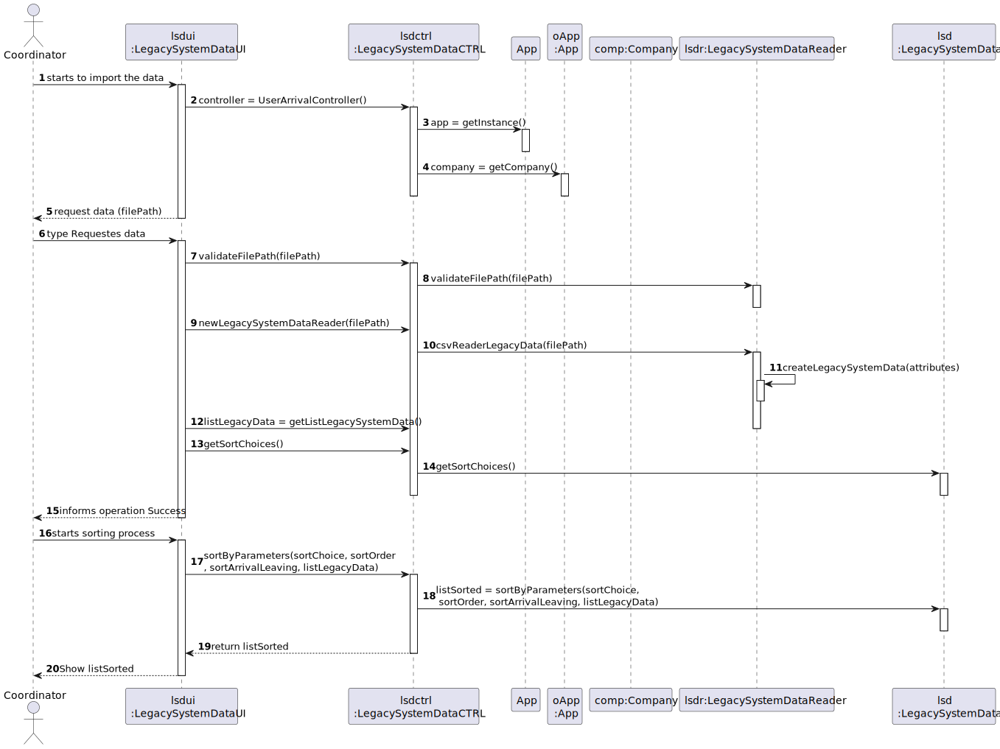

# US 17 - Import data from a legacy system

## 1. Requirements Engineering

### 1.1. User Story Description

* As a Center Coordinator, I want to import data from a legacy system that was used in the past to manage centers.

### 1.2. Customer Specifications and Clarifications 

**From the client clarifications:**

> Question: "We'd like to know if the second column in the US17 file really is the NAME of the Vaccine or if it's the short description of the VaccineType."
>
> Answer: It is the name of the vaccine. The header of the CSV file includes the attribute name, which is called "VaccineName". Moreover, if you search the internet you will see what is Spikevax.

> Question: "Should the imported data be available only while the program is running or should it be mixed with the schedule, arrival, nurse administration and leaving times registered in the system?"
>
> Answer: This US is used to load data from a legacy system. After loading, the data should be available in the application and can be used in other USs.

> Question: "Should we show the sorted list in the GUI or in a exported file?"
>
> Answer: Should show the sorted list in the GUI. In this US the application does not export data...

> Question : The file loaded in US17 have only one day to analyse or it could have more than one day(?) and in US16 we need to select the day to analyse from 8:00 to 20:00
>
> Answer: The file can have data from more than one day. In US16 the center coordinator should select the day for which he wants to analyse the performance of the vaccination center.

> Question: "Should the configuration file be defined , manually, before strating the program? Or Should an administrator or another DGS entity be able to alter the file in a user interface? This question is also important for US06 and US16 since these US also use configuration files, will the same process be applied to them?"
>
> Answer: The configuration file should be edited manually.

> Question: "You answered to a previous question saying that the user should be able to sort by ascending or descending order. Should the user choose in the UI, the order in which the information should be presented? Or should this feature be defined in the configuration file?"
>
> Answer: The center coordinator must use the GUI to select the sorting type (ascending or descending).

> Question: "Regarding the information to be displayed to the user is it all the information available in the legacy system file(SNSUSerNumber; VaccineName; Dose; LotNumber; ScheduledDateTime; ArrivalDateTime; NurseAdministrationDateTime; LeavingDateTime) and the name of the SNS user and the vaccine type Short Description? All of these pieces of information?"
>
> Answer: Read carefully the requirements introduced for Sprint D and discuss the requirements with your team. There is nothing to clarify regarding your question.

> Question: "You already have clarified that when uploading a file from a legacy system the application should check if the SNS Users are already registered and if not, we should register them using US 014. How exactly do you want this to proceed, in case there aren't registered users, should the application ask the center coordinator to select the file with the users data to be uploaded?"
>
> Answer: US14 and US17 are two different features of the system. In US17, if the SNS user does not exist in the system, the vaccination of this SNS user should not be loaded. The system should continue processing the CSV file until all vaccinations are processed.

> Question: "I was analysing the csv file that should be imported for US17 (the one that is in moodle), I noticed that the date attributes are written like this 5/30/2022 I thought that the date format should be DD/MM/YYYY. I also noticed, that the time is written like this, 9:43, I also thought that the time format should be written like this HH:MM, (in this case it would be 09:43). Are the date and time formats diferent for US17?"
>
>
> Answer: That file is from a legacy system, that uses a different date and time format. The date and time should be converted when loading the data into the application that we are developing.

### 1.3. Acceptance Criteria

* **AC1:** Two sorting algorithms should be implemented(to be chosen manually by the coordinator)
* **AC2:** Worst-case time complexity of each algorithm should be documented in the application user manual(in the annexes) that must be delivered with the application. 
* **AC3:** The center Coordinator must be able to choose the file that is to be uploaded.

### 1.4. Found out Dependencies

* There is no dependencies

### 1.5 Input and Output Data

**Input Data:**

* Typed data:
    * file path
    
	
* Selected data:
	* sort choice
	* sort order
	* sort arrival leaving

**Output Data:**

* List sorted
* (In)Success of the operation

### 1.6. System Sequence Diagram (SSD)

### 1.7 Other Relevant Remarks

## 2. OO Analysis

### 2.1. Relevant Domain Model Excerpt 

### 2.2. Other Remarks

n/a

## 3. Design - User Story Realization 

### 3.1. Rationale

| Interaction ID | Question: Which class is responsible for... | Answer                     | Justification (with patterns)                                                                                 |
|:--------------|:--------------------------------------------|:---------------------------|:--------------------------------------------------------------------------------------------------------------|
| Step 1  		    | 	... interacting with the actor?            | LegacySystemDataUI         | Pure Fabrication: there is no reason to assign this responsibility to any existing class in the Domain Model. |
| 			  		       | 	... coordinating the US?                   | LegacySystemDataController | Controller                                                                                                    |
| 		            | 	... knowing the app instance?              | App                        | Creator(Rule 3): App closely uses Singleton                                                                   |
| 		            | 	... knowing the company?                   | App                        | Creator(Rule 4): App has all the data used to initialize the Company                                          |
| Step 2  		    | 							                                     |                            |                                                                                                               |
| Step 3  		    | 	... validates file path?                   | VaccinatedToFile           | IE: owns its data.                                                                                            |
| 		            | 				... creates file with attributes?		     | LegacySystemDataReader     | IE: LegacySystemDataReader creates input array.                                                               |
| 		            | 				... knows the file data?		              | LegacySystemDataController | HC + LC: knows/has its own data.                                                                              |
| 		            | 				... knows the sorting options?		        | LegacySystemData           | HC + LC: knows/has its own data.                                                                              |
| Step 4  		    | 	... informing operation success?           | LegacySystemDataUI         | IE: is responsible for user interactions.                                                                     |
| Step 5  		    |                                             |                            |                                                                                                               |
| 		            | 	... sorts data with parameters?            | LegacySystemData           | IE: owns its data.                                                                                            |
| Step 6  		    | 	... show list sorted?                      | LegacySystemDataUI         | IE: is responsible for user interactions.                                                                                           |

### Systematization ##

According to the taken rationale, the conceptual classes promoted to software classes are: 

 * LegacySystemDataReader
 * LegacySystemData

Other software classes (i.e. Pure Fabrication) identified: 

 * LegacySystemDataUI  
 * LegacySystemDataController

## 3.2. Sequence Diagram (SD)

## 3.3. Class Diagram (CD)

# 4. Tests 

**Test 1:** Check that it is not possible to create an instance of the Task class with null values. 

	@Test(expected = IllegalArgumentException.class)
		public void ensureNullIsNotAllowed() {
		Task instance = new Task(null, null, null, null, null, null, null);
	}
	

**Test 2:** Check that it is not possible to create an instance of the Task class with a reference containing less than five chars - AC2. 

	@Test(expected = IllegalArgumentException.class)
		public void ensureReferenceMeetsAC2() {
		Category cat = new Category(10, "Category 10");
		
		Task instance = new Task("Ab1", "Task Description", "Informal Data", "Technical Data", 3, 3780, cat);
	}

*It is also recommended to organize this content by subsections.* 

# 5. Construction (Implementation)

## Class LegacySystemDataController 

    public LegacySystemDataImporterController() {
        this.oApp = App.getInstance();
        this.oCompany = oApp.getCompany();
    }

    private List listLegacySystemData = new ArrayList<>();
    private List listSorted = new ArrayList();

    public boolean newLegacySystemDataReader(String filePath) throws Exception {
        this.listLegacySystemData = oCompany.getLegacySystemDataReader().csvReaderLegacyData(filePath);
        if (this.listLegacySystemData != null)
            return true;
        else
            return false;
    }

    public List getListLegacySystemData() {
        return listLegacySystemData;
    }

    public void sortLegacySystemData(List listLegacySystemData) {
        boolean ascending = false;
        int position = 0;
        this.listLegacySystemData = oCompany.getLegacySystemData().bubbleSortArrayList(listLegacySystemData, ascending, position);
        System.out.println(listLegacySystemData);

    }

    public List<Object> getSortAlgorithms() {
        return oCompany.getLegacySystemData().getSortAlgorithms();
    }

    public void setSortAlgorithms() {
        oCompany.getLegacySystemData().setSortAlgorithms();

    }

    public List<Object> getSortOrder() {
        return oCompany.getLegacySystemData().getSortOrder();
    }

    public void setSortOrder() {
        oCompany.getLegacySystemData().setSortOrder();

    }

    public List<Object> getSortArrivalLeaving() {
        return oCompany.getLegacySystemData().getSortArrivalLeaving();
    }

    public void setSortArrivalLeaving() {
        oCompany.getLegacySystemData().setSortArrivalLeaving();

    }

    public List sortByParameters(String sortChoice, String sortOrder, String sortArrivalLeaving, List listLegacyData) {
        listSorted =oCompany.getLegacySystemData().sortByParameters(sortChoice, sortOrder, sortArrivalLeaving, listLegacyData);
    return listSorted;
    }
    public void getName(String name){
        oCompany.getLegacySystemData().getName(name);
    }
    public void getDescription(String vaccineDescription){
        oCompany.getLegacySystemData().getDescription(vaccineDescription);
    }

    public List getLeavingList(){
        return oCompany.getLegacySystemData().getLeavingList();
    }

## Class LegacySystemData (sorting process)

		public List sortByParameters(String sortChoice, String sortOrder, String sortArrivalLeaving, List listLegacyData) {

        boolean ascending = true;
        int position;

        if (sortChoice.equals("Bubble Sort")) {
            if (sortOrder.equals("Ascending")) {
                if (sortArrivalLeaving.equals("Sort By Arrival Time")) {
                    position = ARRIVAL_POSITION;
                } else {
                    position = LEAVING_POSITION;
                }
                listLegacy = bubbleSortArrayList(listLegacyData, ascending, position);
            } else {
                if (sortArrivalLeaving.equals("Sort By Arrival Time")) {
                    position = ARRIVAL_POSITION;
                } else {
                    position = LEAVING_POSITION;
                }
                listLegacy = bubbleSortArrayList(listLegacyData, !ascending, position);
            }

        } else if (sortOrder.equals("Ascending")) {
            if (sortArrivalLeaving.equals("Sort By Arrival Time")) {
                Collections.sort(listLegacy, compareByArrivalTime);
            } else {
                Collections.sort(listLegacy, compareByLeavingTime);
            }

        } else {
            if (sortArrivalLeaving.equals("Sort By Arrival Time")) {
                Collections.sort(listLegacy, compareByArrivalTime.reversed());
            } else {
                Collections.sort(listLegacy, compareByLeavingTime.reversed());
            }
        }

        return listLegacy;

    }

# 6. Integration and Demo 

* A new option on the Employee menu options was added.

# 7. Observations

Platform and Organization classes are getting too many responsibilities due to IE pattern and, therefore, they are becoming huge and harder to maintain. 

Is there any way to avoid this to happen?

* divide responsibilities with other classes

