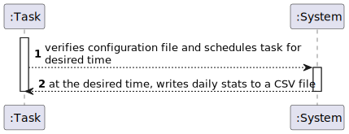
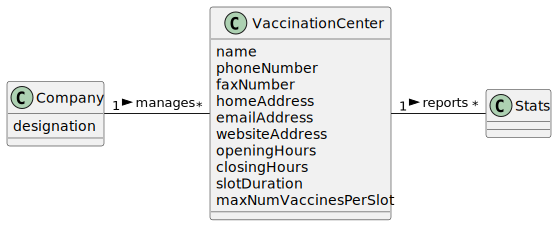
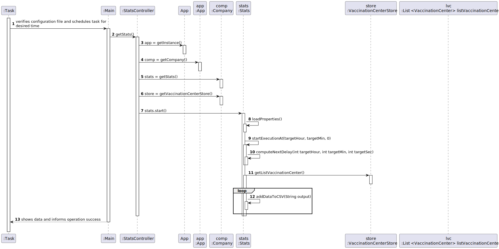
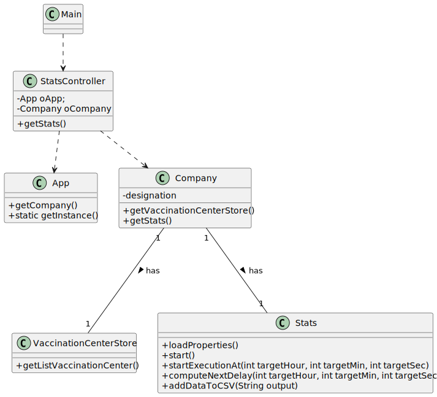

# US 6 - Record daily the total number of vaccinated people in each vaccination center
## 1. Requirements Engineering

### 1.1. User Story Description

DGS wants to record daily the total number of people vaccinated in each vaccination center.

### 1.2. Customer Specifications and Clarifications

**From the client clarifications:**

> **Question:** Should the Company choose first the vaccination center that wants to analyze or should the program show the information of all the vaccination centers?
>
> **Answer:** Please read carefully the USs requirements and discuss them with your team. The application should show the information for all vaccination centers.

> **Question:** We would like to know which kind of user (Administrator, Nurse...) is supposed to have access to the file generated by the system.
>
> **Answer:** Someone from DGS.

> **Question:** Also, is it supposed to have the possibility to change the information on the configuration file? If so, who can do it?
>
> **Answer:** Yes. Please discuss this question with ESOFT teachers.

> **Question:** Dear client, In the acceptance criteria, "the algorithm should run automatically at a time defined in a configuration file and should register a date, the name of the vaccination center and the total number of vaccinated users." How it is supposed to register this information? Should it be recorded in a file (ex: txt,..) or recorded in the system (ex: in a store) ?
>
> **Answer:** The data should be written to a CSV file (field delimiter should be a semicolon).

### 1.3. Acceptance Criteria

* **AC1:** The algorithm should run automatically at a time defined in a configuration file and should register the date, 
the name of the vaccination center and the total number of vaccinated users.

### 1.4. Found out Dependencies

* There is a dependency to class "VaccinationCenterStore".

### 1.5 Input and Output Data

**Input Data:**

* N/A

**Output Data:**

* CSV file

### 1.6. System Sequence Diagram (SSD)

**Alternative 1**

### 1.7 Other Relevant Remarks

N/A

## 2. OO Analysis

### 2.1. Relevant Domain Model Excerpt

### 2.2. Other Remarks

n/a

## 3. Design - User Story Realization

### 3.1. Rationale

**SSD - Alternative 1 is adopted.**

| Interaction ID | Question: Which class is responsible for... | Answer  | Justification (with patterns)  |
|:-------------  |:--------------------- |:------------|:---------------------------- |
| Step 1 			  		 |	... coordinating the US? | StatsController | Controller                             |
|  		 |	... knowing the app instance? | App   |  Creator(Rule 3): App closely uses Singleton  |
|   		 |	... knowing the company? | App   |  Creator(Rule 4): App has all the data used to initialize the Company           |
| | ... creates Stats? | Company | IE: Company creates Stats|
|   		 |	... knowing all Vaccination Centers? | VaccinationCenterStore   |  HC + LC: knows/has all its Vaccination Centers.         |
|   		 |	... initializes Stats? | Stats   |  IE: Initializes Stats.        |
|   		 |	... loads properties from configuration file ? | Stats   |  HC + LC: knows/has all its properties.        |
|   		 |	... starts stats execution? | Stats   |  IE: Starts execution at the desired time          |
|   		 |	... has vaccination center list? | VaccinationCenterStore   |  HC + LC: knows/has all its Vaccination Centers.         |
|   		 |	... wrtes data to a CSV file? | Stats   |  Protected Variation: Stats is able to write any type of CSV file         |
| Step 2		 | 	 |    |    |

### Systematization ##

According to the taken rationale, the conceptual classes promoted to software classes are:

* Company
* VaccinationCenterStore
* Stats

Other software classes (i.e. Pure Fabrication) identified:

* StatsController

## 3.2. Sequence Diagram (SD)

**Alternative 1**

## 3.3. Class Diagram (CD)

**From alternative 1**

# 4. Tests

 N/A
# 5. Construction (Implementation)

## Class Stats

    public class Stats {

    private static final DateFormat DATE_FORMAT = new SimpleDateFormat("dd_MM_yyyy");
    private static final String DATE = DATE_FORMAT.format(new Date());

    private static final String CSV_FILE_PATH = "./results_" + DATE + ".csv";
    private static final String SEPARATOR = ";";

    private Company company;

    public Stats() {
        this.company = company;
    }

    ScheduledExecutorService executorService = Executors.newScheduledThreadPool(1);
    volatile boolean isStopIssued;

    public void start() throws IOException {
        Properties props = new Properties();
        props.load(new FileInputStream("config.properties"));
        String time = props.getProperty(Constants.PARAMS_DAILYSTATISTICS_TIME);
        String[] hoursMinutes = time.split(":");
        int targetHour = Integer.parseInt(hoursMinutes[0]);
        int targetMin = Integer.parseInt(hoursMinutes[1]);
        startExecutionAt(targetHour, targetMin, 0);
    }

    public void startExecutionAt(int targetHour, int targetMin, int targetSec) {
        Runnable taskWrapper = new Runnable(){

            @Override
            public void run()
            {
                addDataToCSV(CSV_FILE_PATH);
                startExecutionAt(targetHour, targetMin, targetSec);
            }

        };
        long delay = computeNextDelay(targetHour, targetMin, targetSec);
        executorService.schedule(taskWrapper, delay, TimeUnit.SECONDS);
    }

    private long computeNextDelay(int targetHour, int targetMin, int targetSec) {
        LocalDateTime localNow = LocalDateTime.now();
        ZoneId currentZone = ZoneId.systemDefault();
        ZonedDateTime zonedNow = ZonedDateTime.of(localNow, currentZone);
        ZonedDateTime zonedNextTarget = zonedNow.withHour(targetHour).withMinute(targetMin).withSecond(targetSec);
        if(zonedNow.compareTo(zonedNextTarget) > 0)
            zonedNextTarget = zonedNextTarget.plusDays(1);

        Duration duration = Duration.between(zonedNow, zonedNextTarget);
        return duration.getSeconds();
    }

    public void stop() {
        executorService.shutdown();
        try {
            executorService.awaitTermination(1, TimeUnit.DAYS);
        } catch (InterruptedException ex) {
            Logger.getLogger(Stats.class.getName()).log(Level.SEVERE, null, ex);
        }
    }

    public void addDataToCSV(String output) {
        File file = new File(output);
        try {
            FileWriter writer = new FileWriter(file);
            List<String> header = new ArrayList<>();
            header.add("Vaccination Center");
            header.add("Vaccination Time");
            header.add("SNS User");

            String collect = header.stream().collect(Collectors.joining(";"));
            writer.write(collect);

            for (VaccinationCenter vaccinationCenter : company.getVaccinationCenterStore().getVaccinationCenters()){
                for(VaccineAdministration administration : vaccinationCenter.getListAdministratedVaccines()){
                    if (DateUtils.isSameDay(administration.getVaccinationTime(), new Date())){
                        DateFormat dateFormat = new SimpleDateFormat("hh:mm:ss");

                        List<String> data = new ArrayList<>();
                        data.add(vaccinationCenter.getName());
                        data.add(dateFormat.format(administration.getVaccinationTime()));
                        data.add(administration.getUserArrival().getSnsUser().getEmailAddress());

                        String rowdata = data.stream().collect(Collectors.joining(SEPARATOR));
                        writer.write(rowdata);
                        writer.write("\n");
                    }
                }
            }

            writer.close();

        } catch (IOException e) {
            e.printStackTrace();
        }
    }

}

# 6. Integration and Demo

* It's working properly

# 7. Observations

Company class is starting to get too many responsabilities.

