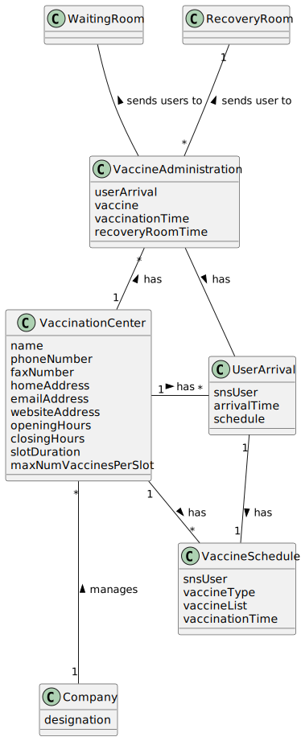

# US 8 - Record the administration of a vaccine to a SNS user, as  nurse
## 1. Requirements Engineering

### 1.1. User Story Description

As a nurse, I want to record the administration of a vaccine to a SNS user. At the end of the recovery period, the user should receive a SMS informing the SNS user that he can leave the vaccinaion center.

### 1.2. Customer Specifications and Clarifications

**From the client clarifications:**

> **Question:** As we can read in Project Description, the vaccination flow follows these steps: 1. Nurse calls one user that is waiting in the waiting room to be vaccinated;2. Nurse checks the user's health data as well as which vaccine to administer; 3. Nurse administers the vaccine and registers its information in the system.
   The doubt is: do you want US08 to cover steps 2 and 3, or just step 3?
>
> **Answer:** 1.The nurse selects a SNS user from a list. 2. Checks user's Name, Age and Adverse Reactions registered in the system. 3. Registers information about the administered vaccine.

> **Question:** 1: Is the nurse responsible for registering in the system the recovery period? 2: If there are no adverse reactions detected/registered, after the given recovery period, the system notifies the user that his/her recovery period has ended, right? 3: If there are adverse reactions detected/registered, the system should not do anything additional?
>
> **Answer:** 1- No. The recovery period starts automatically after registering the administration of a given vaccine.
2 and 3- US7 and US 8 are independent user stories.

> **Question:** 1: The system displays the list of possible vaccines to be administered (considering the age group of the user); then the nurse selects the dose she is going to administer and gets information about the dosage. But wouldn't it be more correct, since the system knows the vaccination history, in other words, if the user has already take x dose(s) of that vaccine, to simply show the dose and the respective dosage and not ask for the nurse to arbitrarily select it?
2: After giving the vaccine to the user, how should the nurse register the vaccine type? by the code?
>
> **Answer:** 1- If it is the first dose, the application should show the list of possible vaccines to be administered. If is is not a single dose vaccine, when the SNS user arrives to take the vaccine, the system should simply show the dose and the respective dosage.
2- A vaccine is associated with a given vaccine type. Therefore, there is no need to register the vaccine type.
Moreover, the nurse should also register the vaccine lot number (the lot number has five alphanumeric characters an hyphen and two numerical characters (example: 21C16-05)).

> **Question:** Supposing that the SNS user has already received a dose of a given vaccine type (for example, COVID-19), the user can only receive the same vaccine or a different one with the same vaccine type?
>
> **Answer:** The SNS user can only receive the same vaccine.

### 1.3. Acceptance Criteria

* **AC1:** The nurse should select a vaccine and the administered dose number.

### 1.4. Found out Dependencies

* There is a dependency to class "VaccinationCenter", "vaccineType", "Vaccine", "VaccineSchedule" and "UserArrival".

### 1.5 Input and Output Data

**Input Data:**

* UserArrival
* Vaccine

**Output Data:**

* VaccineAdministration

### 1.6. System Sequence Diagram (SSD)

**Alternative 1**

### 1.7 Other Relevant Remarks

N/A

## 2. OO Analysis

### 2.1. Relevant Domain Model Excerpt

### 2.2. Other Remarks

n/a

## 3. Design - User Story Realization

### 3.1. Rationale

**SSD - Alternative 1 is adopted.**

| Interaction ID | Question: Which class is responsible for... | Answer  | Justification (with patterns)  |
|:-------------  |:--------------------- |:------------|:---------------------------- |
| Step 1  		 |	... interacting with the actor? | VaccineAdministrationUI   |  Pure Fabrication: there is no reason to assign this responsibility to any existing class in the Domain Model.           |
| 			  		 |	... coordinating the US? | VaccineAdministrationController | Controller                             |
|  		 |	... knowing the app instance? | App   |  Creator(Rule 3): App closely uses Singleton  |
|   		 |	... knowing the company? | App   |  Creator(Rule 4): App has all the data used to initialize the Company           |
|   		 |	... has EmployeeStore? | Company   |  HC + LC: knows/has all its Employees.         |
|   		 |	... knowing the Vaccination Center where the Employee works? | EmployeeStore   |  HC + LC: knows/has all its Employees.        |
| Step 2		 | 	 |    |    |
| Step 3  		 |	... has waiting room (UserArrival)? | VaccinationCenter  | IE: owns its data.  |
|   		 |	... has VaccineSchedule? | UserArrival  | IE: owns its data.  |
|   		 |	... know vaccine list for SNS user? | VaccineSchedule  | HC + LC: knows/has its own data.  |
|   		 |	... gets VaccineAdministration? | VaccinationCenter  | HC + LC: knows/has its own data. |
|   		 |	... validates VaccineAdministration?(global validation) | VaccinationCenter  | IE: owns its data.  |
|   		 |	... sets vaccination time? | VaccineAdministration  | 	IE: object created has its own data.  |
|   		 |	... gets administration date? | VaccineAdministration  | 	HC + LC: knows/has its own data.  |
|   		 |	... instantiates new Vaccine Administration? | VaccinationCenter  | 	Creator (Rule 1): register VaccineAdministration.  |
|   		 |	... saves Vaccine Administration? | VaccinationCenter  | 	IE: object created has its own data.  |
| Step 4  		 |	 |   |  |
| Step 5  		 |	... adds Vaccine Administrations? | VaccinationCenter  | HC + LC: owns all its Vaccine Administrations.  |
|   		 |	... removes user from waiting room? | VaccinationCenter  | HC + LC: knows/has its own data.  |
|   		 |	... moves user to recovery room? | VaccinationCenter  | HC + LC: knows/has its own data.  |
|   		 |	... gets VaccineAdministration? | VaccinationCenter  | HC + LC: knows/has its own data. |
| Step 6  		 |	 |   |  |

### Systematization ##

According to the taken rationale, the conceptual classes promoted to software classes are:

* Company
* EmployeeStore
* VaccinationCenter
* UserArrival
* VaccineSchedule
* VaccineAdministration

Other software classes (i.e. Pure Fabrication) identified:

* StatsController

## 3.2. Sequence Diagram (SD)

**Alternative 1**

## 3.3. Class Diagram (CD)

**From alternative 1**

# 4. Tests
## Class VaccineAdministrationController

      class VaccineAdministrationControllerTest {

    VaccineAdministrationController controller = new VaccineAdministrationController();

    HealthcareCenter hc = new HealthcareCenter("Healthcare", 917876321, 493782,
            "TesteRua1", "teste1@gmail.com", "healthcare.com",
            10, 20, 3, 20);

    VaccineType vt = new ToxoidVaccine( "55563", "test");
    Vaccine v1 = vt.newVaccine("COVID-19 Vaccine", "Pfizer", "18-22", 2, 5, 90);

    @Test
    void getWorking() {
        App.getInstance().doLogin("nurse@lei.sem2.pt","123456");
        ChoosingVaccinationCenterController cvcc = new ChoosingVaccinationCenterController();
        cvcc.setWorking((cvcc.getVaccinationCenters().get(0)));

        assertFalse(controller.getWorking().toString().contains(hc.toString()));
        App.getInstance().doLogout();
    }

    @Test
    void getWaitingRoom() {
        List<Vaccine> vaccineList = new ArrayList<>();
        vaccineList.add(v1);
        controller.setWorking(hc);
        try {
            SNSUser user = new SNSUser("Joao", "male", new SimpleDateFormat("yyyy-MM-dd").parse("2001-10-10"), "teste rua",
                    "917312423", "teste@gmail.com", "345645432", "12341234");
            VaccineSchedule schedule = new VaccineSchedule(user, vt, vaccineList, new SimpleDateFormat("yyyy-MM-dd HH:mm").parse("2022-10-10 10:03"));
            UserArrival arrival = new UserArrival(user, new SimpleDateFormat("yyyy-MM-dd HH:mm").parse("2022-10-10 10:05"), schedule);
            hc.moveToWaitingRoom(arrival);

            List <UserArrival> expected = new ArrayList<>();
            expected.add(arrival);

            assertTrue(expected.equals(controller.getWaitingRoom()));
        } catch (ParseException e) {
            e.printStackTrace();
        }

    }

    @Test
    void getAvailableVaccinesForUser() {
        List<Vaccine> vaccineList = new ArrayList<>();
        vaccineList.add(v1);
        try {
            SNSUser user = new SNSUser("Joao", "male", new SimpleDateFormat("yyyy-MM-dd").parse("2001-10-10"), "teste rua",
                    "917312423", "teste@gmail.com", "345645432", "12341234");
            VaccineSchedule schedule = new VaccineSchedule(user, vt, vaccineList, new SimpleDateFormat("yyyy-MM-dd HH:mm").parse("2022-10-10 10:03"));
            UserArrival arrival = new UserArrival(user, new SimpleDateFormat("yyyy-MM-dd HH:mm").parse("2022-10-10 10:05"), schedule);

            assertTrue(controller.getAvailableVaccinesForUser(arrival).equals(vaccineList));
        } catch (ParseException e) {
            e.printStackTrace();
        }
    }

    @Test
    void getVaccinationCenter() {
        controller.setWorking(hc);

        assertEquals(hc, controller.getVaccinationCenter());
    }

    @Test
    void createVaccineAdministration() {
        controller.setWorking(hc);
        List<Vaccine> vaccineList = new ArrayList<>();
        vaccineList.add(v1);
        try {
            SNSUser user = new SNSUser("Joao", "male", new SimpleDateFormat("yyyy-MM-dd").parse("2001-10-10"), "teste rua",
                    "917312423", "teste@gmail.com", "345645432", "12341234");
            VaccineSchedule schedule = new VaccineSchedule(user, vt, vaccineList, new SimpleDateFormat("yyyy-MM-dd HH:mm").parse("2022-10-10 10:03"));
            UserArrival arrival = new UserArrival(user, new SimpleDateFormat("yyyy-MM-dd HH:mm").parse("2022-10-10 10:05"), schedule);

            VaccineAdministration administration = new VaccineAdministration(arrival, v1, schedule.getTime(), hc.getRECOVERY_ROOM_TIME());

            assertEquals(administration.getVaccine(), controller.createVaccineAdministration(arrival, v1, schedule.getTime()).getVaccine());
            assertEquals(administration.getUserArrival(), controller.createVaccineAdministration(arrival, v1, schedule.getTime()).getUserArrival());
            assertEquals(administration.getVaccinationTime(), controller.createVaccineAdministration(arrival, v1, schedule.getTime()).getVaccinationTime());
            assertEquals(administration.getDoses(), controller.createVaccineAdministration(arrival, v1, schedule.getTime()).getDoses());
            assertEquals(administration.getRecoveryRoomTime(), controller.createVaccineAdministration(arrival, v1, schedule.getTime()).getRecoveryRoomTime());
        } catch (ParseException e) {
            e.printStackTrace();
        }
    }

    @Test
    void addVaccineAdministration() {
        controller.setWorking(hc);
        List<Vaccine> vaccineList = new ArrayList<>();
        vaccineList.add(v1);
        try {
            SNSUser user = new SNSUser("Joao", "male", new SimpleDateFormat("yyyy-MM-dd").parse("2001-10-10"), "teste rua",
                    "917312423", "teste@gmail.com", "345645432", "12341234");
            VaccineSchedule schedule = new VaccineSchedule(user, vt, vaccineList, new SimpleDateFormat("yyyy-MM-dd HH:mm").parse("2022-10-10 10:03"));
            UserArrival arrival = new UserArrival(user, new SimpleDateFormat("yyyy-MM-dd HH:mm").parse("2022-10-10 10:05"), schedule);
            VaccineAdministration administration = new VaccineAdministration(arrival, v1, schedule.getTime(), hc.getRECOVERY_ROOM_TIME());

            assertEquals(controller.addVaccineAdministration(administration), true);
        } catch (ParseException e) {
            e.printStackTrace();
        }
    }

    @Test
    void removeFromWaitingRoom() {
        controller.setWorking(hc);
        List<Vaccine> vaccineList = new ArrayList<>();
        vaccineList.add(v1);
        try {
            SNSUser user = new SNSUser("Joao", "male", new SimpleDateFormat("yyyy-MM-dd").parse("2001-10-10"), "teste rua",
                    "917312423", "teste@gmail.com", "345645432", "12341234");
            VaccineSchedule schedule = new VaccineSchedule(user, vt, vaccineList, new SimpleDateFormat("yyyy-MM-dd HH:mm").parse("2022-10-10 10:03"));
            UserArrival arrival = new UserArrival(user, new SimpleDateFormat("yyyy-MM-dd HH:mm").parse("2022-10-10 10:05"), schedule);
            VaccineAdministration administration = new VaccineAdministration(arrival, v1, schedule.getTime(), hc.getRECOVERY_ROOM_TIME());

            controller.addVaccineAdministration(administration);
            controller.removeFromWaitingRoom(arrival);
            assertEquals(hc.getWaitingRoom().contains(administration), false);
        } catch (ParseException e) {
            e.printStackTrace();
        }
    }

    @Test
    void moveToRecoveryRoom() {
        controller.setWorking(hc);
        List<Vaccine> vaccineList = new ArrayList<>();
        vaccineList.add(v1);
        try {
            SNSUser user = new SNSUser("Joao", "male", new SimpleDateFormat("yyyy-MM-dd").parse("2001-10-10"), "teste rua",
                    "917312423", "teste@gmail.com", "345645432", "12341234");
            VaccineSchedule schedule = new VaccineSchedule(user, vt, vaccineList, new SimpleDateFormat("yyyy-MM-dd HH:mm").parse("2022-10-10 10:03"));
            UserArrival arrival = new UserArrival(user, new SimpleDateFormat("yyyy-MM-dd HH:mm").parse("2022-10-10 10:05"), schedule);
            VaccineAdministration administration = new VaccineAdministration(arrival, v1, schedule.getTime(), hc.getRECOVERY_ROOM_TIME());

            controller.addVaccineAdministration(administration);
            controller.moveToRecoveryRoom(administration, v1);
            assertEquals(hc.getRecoveryRoom().contains(administration), true);
        } catch (ParseException e) {
            e.printStackTrace();
        }
    }

    @Test
    void validateVaccineAdministration() {
        controller.setWorking(hc);
        List<Vaccine> vaccineList = new ArrayList<>();
        vaccineList.add(v1);
        try {
            SNSUser user = new SNSUser("Joao", "male", new SimpleDateFormat("yyyy-MM-dd").parse("2001-10-10"), "teste rua",
                    "917312423", "teste@gmail.com", "345645432", "12341234");
            VaccineSchedule schedule = new VaccineSchedule(user, vt, vaccineList, new SimpleDateFormat("yyyy-MM-dd HH:mm").parse("2022-10-10 10:03"));
            UserArrival arrival = new UserArrival(user, new SimpleDateFormat("yyyy-MM-dd HH:mm").parse("2022-10-10 10:05"), schedule);
            VaccineAdministration administration = new VaccineAdministration(arrival, v1, schedule.getTime(), hc.getRECOVERY_ROOM_TIME());

            assertEquals(null, controller.validateVaccineAdministration(arrival, v1));
            controller.addVaccineAdministration(administration);
            controller.moveToRecoveryRoom(administration, v1);
            hc.removeFromRecoveryRoom(administration);

            administration.setVaccinationTime(new Date());
            assertEquals(administration, controller.validateVaccineAdministration(arrival, v1));
        } catch (ParseException e) {
            e.printStackTrace();
        }
    }
      }
# 5. Construction (Implementation)

## Class VaccineAdministrationController

    public class VaccineAdministrationController {
    private final App oApp;
    private final Company oCompany;
    private VaccinationCenter vaccinationCenter;

    public VaccineAdministrationController() {
        this.oApp = App.getInstance();
        this.oCompany = oApp.getCompany();
    }

    public VaccinationCenter getWorking() {
        vaccinationCenter = oCompany.getEmployeeStore().getWorking(oApp.getCurrentUserSession().getUserId().getEmail());
        return vaccinationCenter;
    }

    public void setWorking(VaccinationCenter vc) {
        vaccinationCenter = vc;
    }

    public List<UserArrival> getWaitingRoom(){
        return vaccinationCenter.getListUserToWaitingRoom();
    }

    public List<Vaccine> getAvailableVaccinesForUser(UserArrival user){
        return user.getSchedule().getVaccineList();
    }

    public VaccinationCenter getVaccinationCenter() {
        return vaccinationCenter;
    }

    public VaccineAdministration createVaccineAdministration(UserArrival user, Vaccine vaccine, Date date) {
        return vaccinationCenter.createVaccineAdministration(user, vaccine, date);
    }

    public boolean addVaccineAdministration(VaccineAdministration vaccineAdministration){
        return vaccinationCenter.addVaccineAdministration(vaccineAdministration);
    }

    public void removeFromWaitingRoom(UserArrival user){
        vaccinationCenter.removeFromWaitingRoom(user);
    }

    public void moveToRecoveryRoom(VaccineAdministration vaccineAdministration, Vaccine vaccine){
        vaccinationCenter.moveToRecoveryRoom(vaccineAdministration);
        //vaccinationCenter.recoveryRoomTimer(vaccineAdministration, vaccine);
    }

    public VaccineAdministration validateVaccineAdministration(UserArrival user, Vaccine vaccine){
        return vaccinationCenter.validateVaccineAdministration(user.getSnsUser(), vaccine);
    }
      }

# 6. Integration and Demo

* It's working properly

# 7. Observations

Company class is starting to get too many responsabilities.

